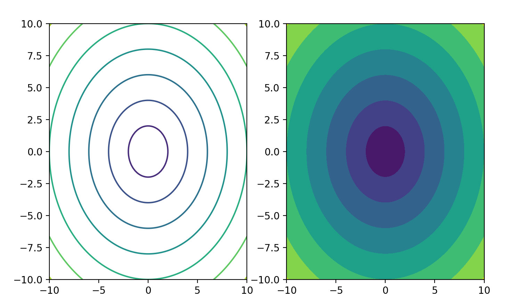

# Matplotlib  


[Python Matplotlib](https://www.bilibili.com/video/BV1EE411F7od)


[链接](https://pan.baidu.com/s/17owff3yr3q1YIr5SIeiRVA )
提取码：b70l


## 绘制基础

在使用Matplotlib绘制图形时，其中有两个最为常用的场景。一个是画点，一个是画线。pyplot基本方法的使用如下表。

| 方法名                           | 说明                           |
| -------------------------------- | ------------------------------ |
| title()                          | 设置图表的名称                 |
| xlabel()                         | 设置x轴名称                    |
| ylabel()                         | 设置y轴名称                    |
| xticks(x,ticks,rotation)         | 设置x轴的刻度,rotation旋转角度 |
| yticks()                         | 设置y轴的刻度                  |
| plot()                           | 绘制线性图表                   |
| show()                           | 显示图表                       |
| legend()                         | 显示图例                       |
| text(x,y,text)                   | 显示每条数据的值  x,y值的位置  |
| figure(name,figsize=(w,h),dpi=n) | 设置图片大小                   |

****

### 绘制直线   

在使用Matplotlib绘制线性图时，其中最简单的是绘制线图。在下面的实例代码中，使用Matplotlib绘制了一个简单的直线。具体实现过程如下：

（1） 导入模块pyplot，并给它指定别名plt，以免反复输入pyplot。在模块pyplot中包含很多用于生产图表的函数。

（2） 将绘制的直线坐标传递给函数==plot()==。

（3） 通过函数plt.show()打开Matplotlib查看器，显示绘制的图形。

   【示例】根据两点绘制一条线   

```
 import matplotlib.pyplot as plt
 #将(0,1)点和(2,4)连起来
 plt.plot([0,2],[1,4])
 plt.show()
```

运行结果如下图：

 


###    绘制折线   

   【示例】绘制折线图   

```
 import matplotlib.pyplot as plt
 x=[1,2,3,4,5]
 squares=[1,4,9,16,25]
 plt.plot(x,squares)
 plt.show()
```

运行结果如下图：

 

###    设置标签文字和线条粗细   

在上面的实例直线结果不够完美，开发者可以绘制的线条样式进行灵活设置。例如：可以设置线条的粗细、设置文字等。

   【示例】绘制折线图并设置样式   

```
import matplotlib.pyplot as plt
datas=[1,2,3,4,5]
squares=[1,4,9,16,25]
plt.plot(datas,squares,linewidth=5)	 #设置线条宽度
plt.title('Numbers',fontsize=24)	#设置图标标题，并在坐标轴上添加标签
plt.xlabel('datas',fontsize=14)		
plt.ylabel('squares',fontsize=14)
plt.show()
```

 

  Matplotlib 默认情况不支持中文，我们可以使用以下简单的方法来解决：

  ==plt.rcParams['font.sans-serif']=['SimHei']== 		#用来正常显示中文标签

****

   【示例】解决标签、标题中的中文问题   

```
import matplotlib.pyplot as plt
datas=[1,2,3,4,5]
squares=[1,4,9,16,25]
plt.plot(datas,squares,linewidth=5) #设置线条宽度#设置中文乱码问题
plt.rcParams['font.sans-serif'] = ['SimHei']#设置图标标题，并在坐标轴上添加标签
plt.title('标题设置',fontsize=24)
plt.xlabel('x轴',fontsize=14)
plt.ylabel('y轴',fontsize=14)
plt.show()
```

 

****

###    绘制一元二次方程的曲线y=x^2

  Matplotlib有很多函数用于绘制各种图形，其中plot函数用于曲线，需要将200个点的x坐标和Y坐标分别以序列的形式传入plot函数，然后调用show函数显示绘制的图形。一元二次方程的曲线

   【示例】一元二次方程的曲线   

```python
import matplotlib.pyplot as plt
x=range(-100,100)		#200个点的x坐标
y=[i  2 for i in x ]	#生成y点的坐标
plt.plot(x,y)		#绘制一元二次曲线
plt.savefig('result.jpg') 	#调用savefig将一元二次曲线保存为result.jpg，
							#如果直接写成 plt.savefig('cos') 会默认生成cos.png
plt.show()
```

运行结果如下图：

 

****

###    绘制正弦曲线和余弦曲线   

使用plt函数绘制任何曲线的第一步都是生成若干个坐标点（x,y），理论上坐标点是越多越好。本例取0到10之间100个等差数作为x的坐标，然后将这100个x坐标值一起传入Numpy的sin和cos函数，就会得到100个y坐标值，最后就可以使用plot函数绘制正弦曲线和余弦曲线。

   【示例】正弦曲线和余弦曲线   

```python
import matplotlib.pyplot as plt
import numpy as np	
x=np.linspace(0,10,100)		#生成x的坐标（0-10的100个等差数列）
sin_y=np.sin(x)
plt.plot(x,sin_y)		#绘制正弦曲线
cos_y=np.cos(x)			#绘制余弦曲线
plt.plot(x,cos_y)
plt.show()
```

运行结果如下图：

 

上面的示例可以看到，调用两次plot函数，会将sin和cos曲线绘制到同一个二维坐标系中，如果想绘制到两张画布中，可以调用subplot()函数将画布分区。

   【示例】将画布分为区域，将图画到画布的指定区域   

```python
import matplotlib.pyplot as plt
import numpy as np
x=np.linspace(1,10,100)		#将画布分为区域，将图画到画布的指定区域
plt.subplot(2,2,1)			#将画布分为2行2列，将图画到画布的1区域plt.subplot(2,2,1)
plt.plot(x,np.sin(x))
plt.subplot(2,2,3)			
plt.plot(x,np.cos(x))
plt.show()
```

运行结果图：

 

****

##    散点图   

使用==scatter==函数可以绘制随机点，该函数需要接收x坐标和y坐标的序列。

   【示例】sin函数的散点图   

```python
import matplotlib.pyplot as plt
import numpy as np
			#画散点图
x=np.linspace(0,10,100)#生成0到10中100个等差数
plt.scatter(x,np.sin(x))
plt.show()
```

运行结果图：

 

****

> `plt.plot(x,sin_y,'o')`
>
> **同样可以画出上图**
>
> 从上面的示例可以看到，使用plot绘制和使用scatter绘制出来的图形是没有区别的，但是使用plot绘制图形的速度由于scatter，所以如果画一堆点，而且点的形式没有差别，那么我们使用plot，
>
> 如果点的形式有差别(指点的大小和颜色不同)则必须使用scatter


【示例】使用scatter画10中大小100中颜色的散点图   

```python
import matplotlib.pyplot as plt
import numpy as np		# 画10种大小，100种颜色的散点图np.random.seed(0)
x=np.random.rand(100)
y=np.random.rand(100)
colors=np.random.rand(100)		#点的个数和颜色的个数要相同
size=np.random.rand(10)*1000	#点的个数和点大小的个数可以不同，如果点的个数大于大小的个数，则会								 #循环获取大小
plt.scatter(x,y,c=colors,s=size,alpha=0.7)	 #s表示点的大小 c表示点的颜色 alpha表示透明度
plt.show()
```

运行结果图：

 

作为线性图的替代，可以通过向 plot() 函数添加格式字符串来显示离散值。 可以使用以下格式化字符。

| 字符 | 描述         |
| ---- | ------------ |
| '-'  | 实线样式     |
| '--' | 短横线样式   |
| '-.' | 点划线样式   |
| ':'  | 虚线样式     |
| '.'  | 点标记       |
| ','  | 像素标记     |
| 'o'  | 圆标记       |
| 'v'  | 倒三角标记   |
| '^'  | 正三角标记   |
| '1'  | 下箭头标记   |
| '2'  | 上箭头标记   |
| '3'  | 左箭头标记   |
| '4'  | 右箭头标记   |
| 's'  | 正方形标记   |
| 'p'  | 五边形标记   |
| ''   | 星形标记     |
| 'h'  | 六边形标记 1 |
| 'H'  | 六边形标记 2 |
| '+'  | 加号标记     |
| 'x'  | X 标记       |
| 'D'  | 菱形标记     |
| 'd'  | 窄菱形标记   |
| '_'  | 水平线标记   |

****

以下是颜色的缩写：

| 字符 | 颜色   |
| ---- | ------ |
| 'b'  | 蓝色   |
| 'g'  | 绿色   |
| 'r'  | 红色   |
| 'c'  | 青色   |
| 'm'  | 品红色 |
| 'y'  | 黄色   |
| 'k'  | 黑色   |
| 'w'  | 白色   |

 【示例】不同种类不同颜色的线   

```python
#不同种类不同颜色的线
x=np.linspace(0,10,100)
plt.plot(x,x+0,'-g')   #实线  绿色
plt.plot(x,x+1,'--c')  #虚线 浅蓝色
plt.plot(x,x+2,'-.k')  #点划线 黑色
plt.plot(x,x+3,'-r')   #实线  红色
plt.plot(x,x+4,'o')   #点  默认是蓝色
plt.plot(x,x+5,'x')   #叉叉  默认是蓝色
plt.plot(x,x+6,'d')   #砖石  红色
```


****

   【示例】不同种类不同颜色的线并添加图例   

```python
#不同种类不同颜色的线并添加图例
x=np.linspace(0,10,100)
plt.plot(x,x+0,'-g',label='-g')   #实线  绿色
plt.plot(x,x+1,'--c',label='--c')  #虚线 浅蓝色
plt.plot(x,x+2,'-.k',label='-.k')  #点划线 黑色
plt.plot(x,x+3,'-r',label='-r')   #实线  红色
plt.plot(x,x+4,'o',label='o')   #点  默认是蓝色
plt.plot(x,x+5,'x',label='x')   #叉叉  默认是蓝色
plt.plot(x,x+6,'dr',label='dr')   #砖石  红色
#添加图例右下角lower right  左上角upper left 边框  透明度  阴影  边框宽度plt.legend(loc='lower right',fancybox=True,framealpha=1,shadow=True,borderpad=1)
plt.show()
```

运行结果图：

 

****

##    绘制柱状图   

使用==bar==函数可以绘制柱状图。柱状图需要水平的x坐标值，以及每一个x坐标值对应的y坐标值，从而形成柱状的图。柱状图主要用来纵向对比和横向对比的。例如，根据年份对销售收据进行纵向对比，x坐标值就表示年份，y坐标值表示销售数据。

   【示例】使用bar绘制柱状图，并设置柱的宽度   

```python
import matplotlib.pyplot as plt
import numpy as np
x=[1980,1985,1990,1995]
x_labels=['1980年','1985年','1990年','1995年']
y=[1000,3000,4000,5000]
plt.bar(x,y,width=3)
plt.rcParams['font.sans-serif']=['SimHei'] #用来正常显示中文标签
plt.xticks(x,x_labels)
plt.xlabel('年份')
plt.ylabel('销量')
plt.title('根据年份销量对比图')
plt.show()
```

运行结果图：

 

需要注意的是bar函数的宽度并不是像素宽度。bar函数会根据二维坐标系的尺寸，以及x坐标值的多少，自动确定每一个柱的宽度，而**width指定的宽度就是这个标准柱宽度的倍数**。该参数值可以是浮点数，如0.5，表示柱的宽度是标准宽度的0.5倍。

【示例】使用==bar和barh==绘制柱状图   

```python
import matplotlib.pyplot as plt
import numpy as np
np.random.seed(0)
x=np.arange(5)
y=np.random.randint(-5,5,5)
print(x,y)
plt.subplot(1,2,1)		# 将画布分隔成一行两列
v_bar=plt.bar(x,y)		#在第一列中画图
plt.axhline(0,color='blue',linewidth=2)		#在第一列的画布中 0位置画一条蓝线
plt.subplot(1,2,2)
h_bar=plt.barh(x,y,color='red')		#barh将y和x轴对换 竖着方向为x轴
plt.axvline(0,color='red',linewidth=2)		#在第二列的画布中0位置处画蓝色的线
plt.show()
```

运行结果图：

 

   【示例】对部分柱状图，使用颜色区分   

```python
import matplotlib.pyplot as plt
import numpy as np
np.random.seed(0)
x=np.arange(5)
y=np.random.randint(-5,5,5)
v_bar=plt.bar(x,y,color='lightblue')
for bar,height in zip(v_bar,y):
	if height<0:    					       
        bar.set(edgecolor='darkred',color='lightgreen',linewidth='3')
plt.show()
```

运行结果图：

 

****

【示例】柱状图使用实例   

```python
import matplotlib.pyplot as plt
import numpy as np
#三天中三部电影的票房变化
real_names=['千与千寻','玩具总动员4','黑衣人：全球追缉']
real_num1=[5453,7548,6543]
real_num2=[1840,4013,3421]
real_num3=[1080,1673,2342]
x=np.arange(len(real_names))		#生成x  第1天  第2天  第3天
x_label=['第{}天'.format(i+1) for i in range(len(real_names))]
width=0.3		#绘制柱状图#设置柱的宽度
plt.bar(x,real_num1,color='g',width=width,label=real_names[0])
plt.bar([i+width for i in x],real_num2,color='b',width=width,label=real_names[1])
plt.bar([i+2width for i in x],real_num3,color='r',width=width,label=real_names[2])
plt.rcParams['font.sans-serif']=['SimHei']		#用来正常显示中文标签
plt.xticks([i+width for i in x],x_label)		#修改x坐标
plt.legend()		#添加图例
plt.title('3天的票房数')		#添加标题
plt.show()
```

运行结果图：

 

****

##    绘制饼状图   

==pie==函数可以绘制饼状图，饼图主要是用来呈现比例的。只要传入比例数据即可。

【示例】 绘制饼状图   

```python
import matplotlib.pyplot as plt
import numpy as np
#准备男、女的人数及比例
man=71351
woman=68187
man_perc=man/(woman+man)
woman_perc=woman/(woman+man)
labels=['男','女']		#添加名称
colors=['blue','red']		#添加颜色
pieplt.rcParams['font.sans-serif']=['SimHei'] 		#用来正常显示中文标签		
#绘制饼状图  labels 名称 	colors：颜色，	explode=分裂  	autopct显示百分比
paches,texts,autotexts=plt.pie([man_perc,woman_perc],labels=labels,colors=colors,explode=(0,0.05),autopct='%0.1f%%') 		#text(男女)   autotexts：比例
for text in autotexts:		#设置饼状图中的字体颜色
	text.set_color('white') 
for text in texts+autotexts:  		#设置字体大小
	text.set_fontsize(20)
plt.show()
```

运行结果图：

 

##    绘制直方图   

直方图与柱状图的分格类似，都是由若干个柱组成，但直方图和柱状图的含义却有很大的差异。直方图是用来观察分布状态的，而柱状图是用来看每一个X坐标对应的Y的值的。也就是说，直方图关注的是分布，并不关心具体的某个值，而柱状图关心的是具体的某个值。使用==hist==函数绘制直方图。

【示例】使用randn函数生成1000个正太分布的随机数，使用hist函数绘制这1000个随机数的分布状态   

```
import numpy as np
import matplotlib.pyplot as plt
#频次直方图，均匀分布
x=np.random.randn(1000)		#正太分布
plt.hist(x)		#画正太分布图
plt.hist(x,bins=100)		#装箱的操作，将10个柱装到一起及修改柱的宽度
```

运行结果图：

 

   【示例】使用normal函数生成1000个正太分布的随机数，使用hist函数绘制这100个随机数的分布状态   

```
import numpy as np
import matplotlib.pyplot as plt
#几个直方图画到一个画布中,第一个参数期望  第二个均值
x1=np.random.normal(0,0.8,1000)
x2=np.random.normal(-2,1,1000)
x3=np.random.normal(3,2,1000)
#参数分别是bins：装箱，alpha：透明度
kwargs=dict(bins=100,alpha=0.4)		#字典
plt.hist(x1,**kwargs)
plt.hist(x2,**kwargs)
plt.hist(x3,**kwargs)
plt.show()
```

运行结果图：

 

##    等高线图   

【示例】使用pyplot绘制等高线图   ，==contourf==

```python
import matplotlib.pyplot as plt
import numpy as np
x=np.linspace(-10,10,100)
y=np.linspace(-10,10,100)
X,Y=np.meshgrid(x,y)		#计算x和y的相交点a
Z=np.sqrt(X**2+Y**2)		# 计算Z的坐标
plt.subplot(1,2,1)
plt.contour(X,Y,Z)
plt.subplot(1,2,2)
plt.contourf(X,Y,Z)
# 颜色越深表示值越小，中间的黑色表示z=0. 
plt.show()
```

运行结果图：

 

****

##    绘制三维图   

使用pyplot包和Matplotlib绘制三维图。

【示例】使用pyplot包和Matplotlib绘制三维图   

```python
import matplotlib.pyplot as plt
from mpl_toolkits.mplot3d import Axes3D		#导入3D包
X=[1,1,2,2]			#创建X、Y、Z坐标
Y=[3,4,4,3]
Z=[1,100,1,1]
fig = plt.figure()
ax = Axes3D(fig)		# 创建了一个Axes3D的子图放到figure画布里面
ax.plot_trisurf(X, Y, Z)
plt.show()
```

运行结果图：

 

****