## 1.numpy快速入门

## 2.Numpy基础

### 创建数组

- ==arange()——创建数组，从0开始==

  ```
   a = arange(5)
  ```

- ==array([ ])——创建向量，中括号写元素==

  ```
   array([0, 1, 2, 3, 4])
  ```

  ```python
  m = array([arange(2), arange(2)])
  array([[0, 1], 
   		[0, 1]])
  ```

  ```
  In: a = array([[1,2],[3,4]])
  Out: array([[1, 2], 
   		[3, 4]])
  In: a[1,0] 
  Out: 3
  ```

|   数据类型    | 字符编码 |
| :-----------: | :------: |
|     整数      |    i     |
|  无符号整数   |    u     |
| 单精度浮点数  |    f     |
| 双精度浮点数  |    d     |
|    布尔值     |    b     |
|     复数      |    D     |
|    字符串     |    S     |
| unicode字符串 |    U     |
|  void（空）   |    V     |

```
In: arange(7, dtype='f') 
Out: array([ 0., 1., 2., 3., 4., 5., 6.], dtype=float32)
```

- ==切片索引使用	:	号==

  ```
    In: a = arange(9) 
    In: a[3:7] 
    Out: array([3, 4, 5, 6])
    In: a[:7:2] 
    Out: array([0, 2, 4, 6])
    In: a[::-1] 
    Out: array([8, 7, 6, 5, 4, 3, 2, 1, 0])
  ```

- ==reshape()——改变维度==

   ```
    In: b = arange(24).reshape(2,3,4) 
    Out: array([[[ 0, 1, 2, 3], 
                 [ 4, 5, 6, 7], 
                 [ 8, 9,10,11]], 
                 [[12, 13, 14, 15], 
                 [16, 17, 18, 19], 
                 [20, 21, 22, 23]]])
   ```

- ==revel()——多维数据展平==

   ```
    array([[ 0, 1, 2, 3], 
     [ 4, 5, 6, 7], 
     [ 8, 9,10,11]]) 
    In: b.ravel() 
    Out: array([ 0, 1, 2, 3, 4, 5, 6, 7, 8, 9, 10, 11])
   ```

- ==flatten()——多维数据展平，会请求分配内存来保存结果==

- ==shape()——使用元组设置维度==，

  ```
  b.shape = (3,4) 
  Out: array([ 0, 1, 2, 3], 
             [ 4, 5, 6, 7], 
             [ 8, 9,10,11]]
  ```

- ==transpose()——转置矩阵==

- ==resize()——和reshape功能一样,但resize会直接修改所操作的数组==

### 组合数组

- ==水平组合——hstack和concatenate；==

  ```
   hstack((a, b))
   concatenate((a, b), axis=1)
  ```

  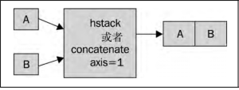

- ==垂直组合——vstack和concatenate；==

  ```
  vstack((a, b))
  concatenatel((a, b), axis = 0)
  ```

  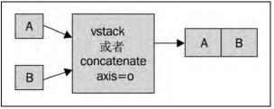

- ==深度组合——dstack；==

  ```
  dstack((a, b)) 
  ```

- ==列组合——column_stack；==对于二维数组，column_stack与hstack的效果是相同的

  ```
  column_stack((oned, twice_oned)) 
  ```

- ==行组合——row_stack；==对于二维数组，row_stack与vstack的效果是相同的： 

  ```
   row_stack((oned, twice_oned))
  ```

- ==水平分割——hsplit、split；==

  ```
  array([[0, 1, 2], 
   [3, 4, 5], 
   [6, 7, 8]]) 
  In: hsplit(a, 3)
  Out: [array([[0], [3], [6]]), array ([[1], [4], [7]]), array ([[2], [5], [8]])]
  
  split(a, 3, axis=1)
  ```

- ==垂直分割——vsplit、split==；

  ```
  In: vsplit(a, 3) 
  Out: [array([[0, 1, 2]]), array([[3, 4, 5]]), array([[6, 7, 8]])]
  split(a, 3, axis=0)
  ```

- ==深度分析——dsplit；==

  ```
   dsplit(c, 3)
  ```

### 数组属性

- ***\*ndim\****属性，给出数组的维数，或数组轴的个数：

- ***\*size\****属性，给出数组元素的总个数，如下所示： 

- ***\*itemsize\****属性，给出数组中的元素在内存中所占的字节数：

- 如果你想知道整个数组所占的存储空间，可以用***\*nbytes\****属性来查看


- ***\*T\****属性的效果和transpose函数一样，如下所示：

- ***\*real\****属性，给出复数数组的实部

- ***\*imag\****属性，给出复数数组的虚部：

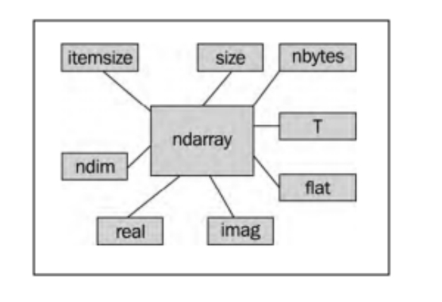 

- 我们可以使用***\*tolist\****函数将NumPy数组转换成Python列表。


- ***\*astype\****函数可以在转换数组时指定数据类型：`b.astype(int)` 


## 3.常用函数

- ==创建单位矩阵——eye==

  ```
  i2 = np.eye(2)
  ```

- ==savetxt(文件名，数组)——将数据存储到文件中==

  ```
  np.savetxt("eye.txt", i2)
  ```

- ==loadtxt(文件名，选段，等等)——读取CSV文件==

  ```
  c,v=np.loadtxt('data.csv', delimiter=',', usecols=(6,7), unpack=True)
  ```

- ==average()——加权平均值==

  ```
  vwap = np.average(c, weights=v)
  ```

- ==mean()——算术平均值==

- ==ptp函数可以计算数组的取值范围==

  ```
  np.ptp(h)
  ```

- ==median的函数将帮助我们找到中位数==

- ==diff函数可以返回一个由相邻数组元素的差值构成的数组==

- ==std函数计算标准差==

- ==log函数得到每一个收盘价的对数==

- ==where函数可以根据指定的条件返回所有满足条件的数组元素的索引值==

  ```
  posretindices = np.where(returns > 0)
  ```

- ==maximum所有的数组中第一个元素的最大值、第二个元素的最大值等==
- ==minimum==

- ==convolve函数。简单移动平均线只不过是计算与等权重的指示函数的卷积==

  ```
  weights = np.ones(N) / N
  c = np.loadtxt('data.csv', delimiter=',', usecols=(6,), unpack=True) 
  sma = np.convolve(weights, c)[N-1:-N+1]
  ```

- ==exp函数可以计算出每个数组元素的指数==

- ==linspace函数需要一个起始值和一个终止值参数，以及可选的元素个数的参数，	它将返回一个元素值在指定的范围内均匀分布的数组。==

  ```
   np.linspace(-1, 0, 5)
   Linspace [-1. -0.75 -0.5 -0.25 0. ]
  ```

- ==fill函数可以将数组元素的值全部设置为一个指定的标量值==

  ```
  averages = np.zeros(N) 
  averages.fill(sma[i - N - 1])
  ```

- ==clip方法返回一个修剪过的数组，也就是将所有比给定最大值还大的元素全部设	为给定的最大值，而所有比给定最小值还小的元素全部设为给定的最小值==

  ```
   a.clip(1, 2)
   a = [0 1 2 3 4] 
  Clipped [1 1 2 2 2]
  ```

- ==compress方法返回一个根据给定条件筛选后的数组==

  ```
   a.compress(a > 2)
   [0 1 2 3] 
  Compressed [3]
  ```

- ==prod方法，可以计算数组中所有元素的乘积==

  ```
  b.prod()
  b = [1 2 3 4 5 6 7 8] 
  Factorial 40320
  ```

- ==cumprod方法，计算数组元素的累积乘积==

  ```
   b.cumprod()
   Factorials [ 1 2 6 24 120 720 5040 40320]
  ```


## 4.便捷函数

- ==cov函数计算股票收益率的协方差矩阵==

  ```
   np.cov(bhp_returns, vale_returns)
  ```

- ==diagonal函数查看对角线上的元素==

  ```
   covariance.diagonal()
  ```

- ==trace函数计算矩阵的迹，即对角线上元素之和==

- ==corrcoef函数计算相关系数==

  ```
   np.corrcoef(bhp_returns, vale_returns)
  ```

- ==ployfit函数可以用多项式去拟合一系列数据点，无论这些数据点是否来自连续函数都适用==

  ```
  bhp=np.loadtxt('BHP.csv', delimiter=',', usecols=(6,), unpack=True) 
  vale=np.loadtxt('VALE.csv', delimiter=',', usecols=(6,),unpack=True) 
  t = np.arange(len(bhp)) 
  poly = np.polyfit(t, bhp - vale, 3)	#三次多项式 
  
   [ 1.11655581e-03 -5.28581762e-02 5.80684638e-01 5.79791202e+01]
  ```

- ==polyval函数，就可以推断下一个值==

  ```
  print "Next value", np.polyval(poly, t[-1] + 1)
  Next value 57.9743076081
  ```

- ==roots函数找出我们拟合的多项式函数什么时候到达0值==

  ```
   np.roots(poly)
   Roots [35.48624287+30.62717062j 35.48624287-30.62717062j -23.63210575 +0.j]
  ```

- ==polyder函数对多项式函数求导==

  ```
  der = np.polyder(poly)
  Derivative [ 0.00334967 -0.10571635 0.58068464]
  ```

- ==argmax和argmin找出最大值点和最小值点==

  ```
  vals = np.polyval(poly, t) 
  print np.argmax(vals) 
  print np.argmin(vals)
  7 
  24
  ```

- ==sign函数可以返回数组中每个元素的正负符号，数组元素为负时返回-1，为正时返回1，否则返回0==

  ```
  Change [ 1.92 -1.08 -1.26 0.63 -1.54 -0.28 0.25 -0.6 2.15 0.69 -1.33 1.16 
   1.59 -0.26 -1.29 -0.13 -2.12 -3.91 1.28 -0.57 -2.07 -2.07 2.5 1.18 
  -0.88 1.31 1.24 -0.59]
  signs = np.sign(change)
  Signs [ 1. -1. -1. 1. -1. -1. 1. -1. 1. 1. -1. 1. 1. -1. -1. -1. -1. -1. -1. -1. -1. 1. 1. 1. -1. 1. 1. -1.]
  ```

- ==piecewise函数来获取数组元素的正负。piecewise①函数可以分段给定取值。使用合适的返回值和对应的条件调用该函数==

  ```python
  pieces = np.piecewise(change, [change < 0, change > 0], [-1, 1])
  Pieces [ 1. -1. -1. 1. -1. -1. 1. -1. 1. 1. -1. 1. 1. -1. -1. -1. -1. -1. -1. -1. -1. 1. 1. 1. -1. 1. 1. -1.]
  ```

- ==hanning函数是一个加权余弦的窗函数，生成一个长度为N的窗口==

  ```
  weights = np.hanning(N)
  Weights [ 0. 0.1882551 0.61126047 0.95048443 0.95048443 0.61126047  0.1882551 0. ]
  ```

- ==isreal函数来判断数组元素是否为实数，返回布尔值==

  ```
  reals = np.isreal(xpoints)
  Real number [ True True True True False False False False]
  ```

- ==select函数可以根据一组给定的条件，从一组元素中挑选出符合条件的元素并返回数组==

  ```
  xpoints = np.select([reals], [xpoints])
  [ 27.73321597 27.51284094 24.32064343 18.86423973  0. 0. 0. 0.]
  ```

- ==polysub函数对多项式作差==

  ```
  poly_sub = np.polysub(poly_bhp, poly_vale)
  ```


## 5.矩阵和通用函数

- ==mat函数创建矩阵；矩阵的行与行之间用分号隔开，行内的元素之间用空格隔开==

  ```
  A = np.mat('1 2 3; 4 5 6; 7 8 9')
  A	[[1 2 3] 
   	[4 5 6] 
  	[7 8 9]]
  ```

- ==用T属性获取转置矩阵==；==用I属性获取逆矩阵==

  ```
   A.T
   A.I
  ```

- ==bmat函数，利用一些已有的较小的矩阵来创建一个新的大矩阵==

  ```
  A [[ 1. 0.] 
  	 [ 0. 1.]]
  B [[ 2. 0.] 
   	[ 0. 2.]]
  np.bmat("A B; A B")
  [[ 1. 0. 2. 0.] 
   [ 0. 1. 0. 2.] 
   [ 1. 0. 2. 0.] 
   [ 0. 1. 0. 2.]]
  ```

- ==divide函数在整数和浮点数除法中均只保留整数部分==,    ==/==

  ```
  a = np.array([2, 6, 5]) 
  b = np.array([1, 2, 3])
  np.divide(a, b)
  np.divide(b, a)
  [2 3 1]
  [0 0 0]
  ```

- ==true_divide函数与数学中的除法定义更为接近，即返回除法的浮点数结果而不作截断==

  ```
  np.true_divide(a, b)
  np.true_divide(b, a)
  [2. 3. 1.66666667] 
  [0.5 0.33333333 0.6 ]floor_division
  ```

- ==floor_divisione函数总是返回整数结果,相当于先调用divide函数再调用floor函数。==      ==//==

  ```
   np.floor_divide(c, b)
   np.floor_divide(b, c)
  [ 3. 3. 3.] 
  [ 0. 0. 0.]
  ```

- ==本算术运算符+、-和*隐式关联着通用函数add、subtract和multiply==

### 通用函数

通用函数有四个方法，不过这些方法只对输入两个参数、输出一个参数的ufunc对象有效，

- 对于add函数，其对数组的reduce计算结果等价于对数组元素求和

  ```
  a = np.arange(9)
  print "Reduce", np.add.reduce(a)
  Reduce 36
  ```

- accumulate方法同样可以递归作用于输入数组。但与reduce方法不同的是，它将存储运算的中间结果并返回

  ```
  print "Accumulate", np.add.accumulate(a)
  Accumulate [ 0 1 3 6 10 15 21 28 36]
  ```

- reduceat方法需要输入一个数组以及一个索引值列表作为参数

  ```
   np.add.reduceat(a, [0, 5, 2, 7])
   Reduceat [10 5 20 15]		#0~5之间的数相加；5~2之间的数相加
  ```

- outer方法返回一个数组，它的秩（rank）等于两个输入数组的秩的和。它会作用于两个输入数组之间存在的所有元素对

  ```
  print "Outer", np.add.outer(np.arange(3), a)
  Outer [[ 0 1 2 3 4 5 6 7 8] 
         [ 1 2 3 4 5 6 7 8 9] 
         [ 2 3 4 5 6 7 8 9 10]]
  ```


- ==remainder函数逐个返回两个数组中元素相除后的余数==,==mod函数与remainder函数的功能完全一致==,   ==%==

  ```
  a = np.arange(-4, 4) 
  print "Remainder", np.remainder(a, 2)
  Remainder [0 1 0 1 0 1 0 1]
  ```

- ==fmod函数所得余数的正负由被除数决定，与除数的正负无关==

  ```
  print "Fmod", np.fmod(a, 2)
  Fmod [ 0 -1 0 -1 0 1 0 1]
  ```

- ==matrix函数创建矩阵==

  ```
  F = np.matrix([[1, 1], [1, 0]])
  F [[1 1] 
   	[1 0]]
  ```

- ==rint函数对浮点数取整但不改变浮点数类型==

### 位操作函数和比较函数

XOR操作符又被称为不等运算符，因此当两个操作数的符号不一致时，XOR操作的结果为负数

- ==^操作符对应于bitwise_xor函数，==

  ```
  x = np.arange(-9, 9) 
  y = -x 
  print "Sign different?", (x ^ y) < 0
   [ True True True True True True True True True False True True True 
  True True True True True]
  ```

- <操作符对应于less函数
- &操作符对应于bitwise_and函数，
- ==操作符对应于equal函数
- <<操作符对应于left_shift函数


## 6.深入学习numpy模块

### numpy.linalg模块

- ==numpy.linalg模块中的inv函数可以计算逆矩阵==

  ```
   A [[ 0 1 2] 
       [ 1 0 3] 
       [ 4 -3 8]]
  inverse = np.linalg.inv(A)
  [[-4.5 7. -1.5] 
   [-2. 4. -1. ] 
   [ 1.5 -2. 0.5]]
  ```

- ==solve函数求解线性方程组；==可以求解形如Ax=b的线性方程组，其中A为矩阵，b为一维或二维的数组

  ```
  A[[1 -2 1]
  	[0 2 -8]
  	[-4 5 9]]
  b[0 8 -9]
  x = np.linalg.solve(A, b) 
  print "Solution", x
  Solution [ 29. 16. 3.]
  ```

- ==dot函数检查求得的解是否正确==

  ```
  x = np.linalg.solve(A, b) 
  print "Check\n", np.dot(A , x)
  Check
   	[[ 0.  8. -9.]]
  ```

- ==eigvals 函数可以计算矩阵的特征值==

  ```
  A [[ 3 -2] 
   	[ 1 0]]
   np.linalg.eigvals(A)
    [ 2. 1.]
  ```

- ==eig函数可以返回一个包含特征值和对应的特征向量的元组==

  ```
  eigenvalues, eigenvectors = np.linalg.eig(A) 
  print "First tuple of eig", eigenvalues 
  print "Second tuple of eig\n", eigenvectors
  
  First tuple of eig [ 2. 1.] 
  Second tuple of eig 
  [[ 0.89442719 0.70710678] 
   [ 0.4472136 0.70710678]]
  ```

- ==svd函数可以对矩阵进行奇异值分解。==该函数返回3个矩阵——*U*、Sigma和*V*，其中*U*和*V*是

  正交矩阵，Sigma包含输入矩阵的奇异值。

  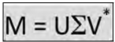

  ```
  A [[ 4 11 14] 
   	[ 8 7 -2]]
  U, Sigma, V = np.linalg.svd(A, full_matrices=False)
  U 
  [[-0.9486833 -0.31622777] 
   [-0.31622777 0.9486833 ]] 
  Sigma 
  [ 18.97366596 9.48683298] 
  V 
  [[-0.33333333 -0.66666667 -0.66666667] 
   [ 0.66666667 0.33333333 -0.66666667]]
  ```

- ==diag函数生成完整的奇异值矩阵==

  ```
   U * np.diag(Sigma) * V
   [[ 4. 11. 14.] 
   [ 8. 7. -2.]]
  ```

- ==pinv函数进行求解广义逆矩阵==

  ```
  A [[ 4 11 14] 
   	[ 8 7 -2]]
  pseudoinv = np.linalg.pinv(A)
  
  [[-0.00555556 0.07222222] 
   [ 0.02222222 0.04444444] 
   [ 0.05555556 -0.05555556]]
  ```

- ==det函数可以计算矩阵的行列式==

  ```
  A [[ 3. 4.] 
  	[ 5. 6.]]
   np.linalg.det(A)
   Determinant -2.0
  ```

### numpy.fft模块

- ==fft的模块提供了快速傅里叶变换的功能==，==ifft可以近似还原初始信号==。

  ```
  x = np.linspace(0, 2 * np.pi, 30) 
  wave = np.cos(x)
  transformed = np.fft.fft(wave)
  ```

- ==numpy.linalg模块中的fftshift函数可以将FFT输出中的直流分量移动到频谱的中央==，==ifftshift函数进行逆操作==

  ```
  transformed = np.fft.fft(wave)
  shifted = np.fft.fftshift(transformed)
  np.fft.ifftshift(shifted)
  ```

### numpy.random模块

- ==binomial==每一轮抛9枚硬币，如果少于5枚硬币正面朝上，你将损失1份赌注；否则，你将赢得1份赌注。

  ```
  np.random.binomial(9, 0.5, size=len(cash)) # size存储赌注数
  ```

- ==normal函数产生指定数量的随机数（正态分布）==

  ```
  N=10000
  normal_values = np.random.normal(size=N)
  ```

  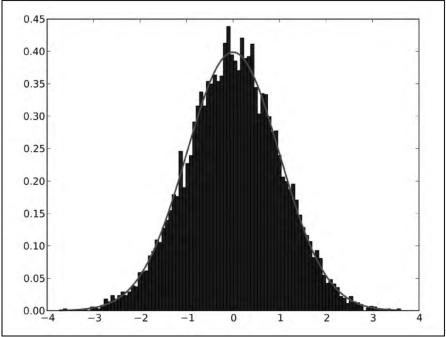

- ==lognormal函数；对数正态分布是自然对数服从正态分布的任意随机变量的概率分布==

  ```
  N=10000 
  lognormal_values = np.random.lognormal(size=N)
  ```

  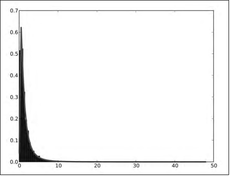


## 7.专用函数

### 排序

- ==sort函数返回排序后的数组；== 
- ==lexsort函数根据键值的字典序进行排序；== 
- ==argsort函数返回输入数组排序后的下标；== 
- ==ndarray类的sort方法可对数组进行原地排序；== 
- ==msort函数沿着第一个轴排序；== 
- ==sort_complex函数对复数按照先实部后虚部的顺序进行排序。==

### 搜索

- ==argmax函数返回数组中最大值对应的下标==

  ```
  >>> a = np.array([2, 4, 8]) 
  >>> np.argmax(a) 
  2
  ```

- ==nanargmax函数提供相同的功能，但忽略NaN值==

  ```
  >>> b = np.array([np.nan, 2, 4]) 
  >>> np.nanargmax(b) 
  2
  ```

- ==argmin和nanargmin函数的功能类似，只不过换成了最小值==

- ==argwhere函数根据条件搜索非零的元素，并分组返回对应的下标==

  ```
  >>> a = np.array([2, 4, 8]) 
  >>> np.argwhere(a <= 4) 
  array([[0], 
   		[1]])
  ```

- ==searchsorted函数为指定的插入值返回一个在有序数组中的索引位置，从这个位置插入可以保持数组的有序性==

  ```
  a = np.arange(5)
  indices = np.searchsorted(a, [-2, 7])
  Indices [0 5]
  ```

- ==extract函数返回满足指定条件的数组元素==

  ```
  a = np.arange(7)
  condition = (a % 2) == 0
  np.extract(condition, a)
   [0 2 4 6]
  ```

- ==insert函数构建完整的数组==

  ```
   np.insert(a, indices, [-2, 7])
    [-2 0 1 2 3 4 7]
  ```

- ==nonzero函数专门用来抽取非零的数组元素==

  ```
   np.nonzero(a)
   (array([1, 2, 3, 4, 5, 6]),)
  ```

### 金融函数

- ==fv函数计算所谓的终值（future value），即基于一些假设给出的某个金融资产在未来某一时间点的价值。== 终值决定于4个参数——利率、期数、每期支付金额以及现值。

  ```
   np.fv(0.03/4, 5 * 4, -10, -1000)
   #以利率3%、每季度支付金额10、存款周期5年以及现值1 000为参数计算终值
  ```

  ​	

- ==pv函数计算现值（present value），即金融资产当前的价值。== 需要利率、期数、每期支付金额这些参数，不过这里输入为终值，输出为现值。

  ```
   np.pv(0.03/4, 5 * 4, -10, 1376.09633204)
  ```

  

- ==npv函数返回的是净现值（net present value），即按折现率计算的净现金流之和。== 该函数需要两个参数，即利率和一个表示现金流的数组

  ```
  [-100 38 48 90 17 36]	#现金流
  np.npv(0.03, cashflows)
   	107.435682443
  ```

  

- ==pmt函数根据本金和利率计算每期需支付的金额。== 

  ```
   np.pmt(0.10/12, 12 * 30, 1000000)	#贷款100万，年利率为10%，要用30年时间还完贷款
   
  ```

  

- ==irr函数计算内部收益率（internal rate of return）。==内部收益率是是净现值为0时的有效利率，不考虑通胀因素。 

  ```
   np.irr([-100, 38, 48, 90, 17, 36])
    0.373420226888
  ```

- ==mirr函数计算修正后内部收益率（modified internal rate of return），是内部收益率的改进版本。== 

- ==nper函数计算定期付款的期数。== 所需的参数为贷款利率、固定的月供以及贷款额

  ```
   np.nper(0.10/12, -100, 9000)
    167.047511801
  ```

  

- ==rate函数计算利率（rate of interest）；==根据给定的付款期数、每期付款资金、现值和终值计算利率

  ```
  12 * np.rate(167, -100, 9000, 0)
  	0.0999756420664
  ```

### 窗函数

- ==bartlett函数绘制了巴特利特窗==

  ```
  window = np.bartlett(42)
  ```

  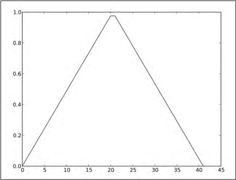

- ==blackman函数返回布莱克曼窗==

  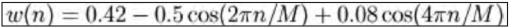

- ==hamming函数返回汉明窗==

  ```
  window = np.hamming(42)
  ```

  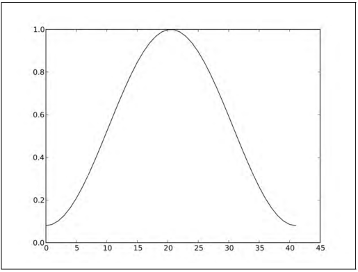

- ==kaiser函数返回凯泽窗，==第一个参数为输出点的数量，第二个参数为*β*值。

  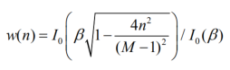

  ```
  window = np.kaiser(42, 14)
  ```

  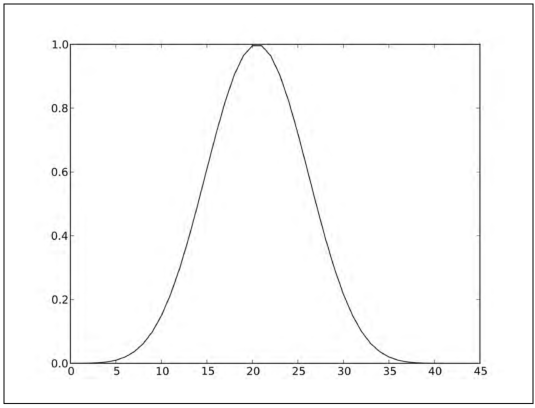

- ==i0 表示第一类修正的零阶贝塞尔函数==

  ```
  x = np.linspace(0, 4, 100)
  vals = np.i0(x)
  ```

  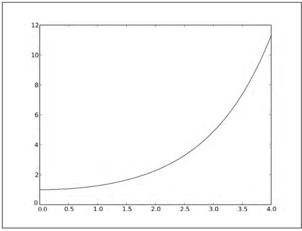

- ==sinc函数绘制了著名的sinc函数==

  ```
  x = np.linspace(0, 4, 100)
  vals = np.sinc(x)
  ```

  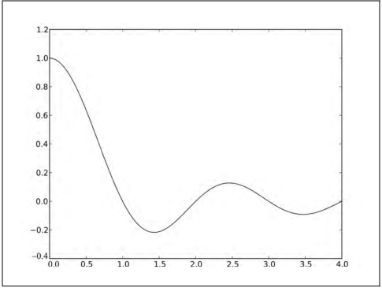


## 8.质量控制

### numpy.testing包

中有很多实用的工具函数考虑了浮点数比较的问题，可以测试前提是否成立

| 函数                      | 描述                                                         |
| ------------------------- | ------------------------------------------------------------ |
| assert_almost_equal       | 如果两个数字的近似程度没有达到指定精度，就抛出异常           |
| assert_approx_equal       | 如果两个数字的近似程度没有达到指定有效数字，就抛出异常       |
| assert_array_almost_equal | 如果两个数组中元素的近似程度没有达到指定精度，就抛出异常     |
| assert_array_equal        | 如果两个数组对象不相同，就抛出异常                           |
| assert_array_less         | 两个数组必须形状一致，并且第一个数组的元素严格小于第二个数组的元素，否则就抛出异常 |
| assert_equal              | 如果两个对象不相同，就抛出异常                               |
| assert_raises             | 若用填写的参数调用函数没有抛出指定的异常，则测试不通过       |
| assert_warns              | 若没有抛出指定的警告，则测试不通过                           |
| assert_string_equal       | 断言两个字符串变量完全相同                                   |
| assert_allclose           | 如果两个对象的近似程度超出了指定的容差限，就抛出异常         |

- assert_almost_equal  如果两个数字的近似程度没有达到指定精度，就抛出异常

  ```
  np.testing.assert_almost_equal(0.123456789, 0.123456780, decimal=7)
    None	#未抛出异常
  np.testing.assert_almost_equal(0.123456789, 0.123456780, decimal=8)
     	
  Traceback (most recent call last): 		#异常
     ... 
  raiseAssertionError(msg) 
  AssertionError: 
  Arrays are not almost equal 
  ACTUAL: 0.123456789 
  DESIRED: 0.12345678
  ```

- assert_approx_equal  如果两个数字的近似程度没有达到指定有效数字，就抛出异常

  ```
  np.testing.assert_approx_equal(0.123456789, 0.123456780, significant=8)
    None
  np.testing.assert_approx_equal(0.123456789, 0.123456780, significant=9)	
     	
  Traceback (most recent call last):
      ... 
  raiseAssertionError(msg) 
  AssertionError: 
  Items are not equal to 9 significant digits: 
  ACTUAL: 0.123456789 
  DESIRED: 0.12345678
  ```

- assert_array_almost_equal  如果两个数组中元素的近似程度没有达到指定精度，就抛出异常

  ```
  np.testing.assert_array_almost_equal([0, 0.123456789], [0, 
  0.123456780], decimal=8)
  	None	
   np.testing.assert_array_almost_equal([0, 0.123456789], [0, 
  0.123456780], decimal=9)
  
  Traceback (most recent call last): 
   ... 
  assert_array_compare 
  raiseAssertionError(msg) 
  AssertionError:
  Arrays are not almost equal 
  (mismateh 50.0%) 
  x: array([ 0. , 0.12345679]) 
  y: array([ 0. , 0.12345678])
  ```

- assert_allclose 		如果两个对象的近似程度超出了指定的容差限，就抛出异常

- assert_array_equal  如果两个数组对象不相同，就抛出异常

  ```
  np.testing.assert_allclose([0, 0.123456789, np.nan], [0, 0.123456780, 
  np.nan], rtol=1e-7, atol=0)
  	None
   np.testing.assert_array_equal([0, 0.123456789, np.nan], [0, 0.123456780, 
  np.nan])
  
  Traceback (most recent call last): 
   ... 
  assert_array_compare 
  raiseAssertionError(msg) 
  AssertionError: 
  Arrays are not equal 
  (mismatch 50.0%) 
  x: array([ 0. ,0.12345679, nan] 
  y: array([ 0. ,0.12345678, nan])
  ```

- assert_array_less  两个数组必须形状一致，并且第一个数组的元素严格小于第二个数组的元素，否则就抛出异常

  ```
  np.testing.assert_array_less([0, 0.123456789, np.nan], [1, 0.23456780, np.nan])
  	 None
  np.testing.assert_array_less([0, 0.123456789, np.nan], [0, 0.123456780, np.nan])
  
  Traceback (most recent call last): 
   ... 
  raiseAssertionError(msg) 
  AssertionError:
  Arrays are not less-ordered 
  (mismatch 100.0%) 
  x: array([ 0. , 0.12345679, nan]) 
  y: array([ 0. , 0.12345678, nan])
  ```

- assert_equal  如果两个对象不相同，就抛出异常  

  ```
  np.testing.assert_equal((1, 2), (1, 3))
  	
  Traceback (most recent call last): 
   ... 
  raiseAssertionError(msg) 
  AssertionError: 
  Items are not equal: 
  item=1 
   ACTUAL: 2 
   DESIRED: 3
  ```

- assert_string_equal  断言两个字符串变量完全相同  

  ```
  np.testing.assert_string_equal("NumPy", "NumPy")
   	None
  np.testing.assert_string_equal("NumPy", "Numpy")
  
  Traceback (most recent call last): 
   ... 
  raiseAssertionError(msg) 
  AssertionError: Differences in strings: 
  - NumPy? ^ 
  + Numpy? ^
  ```


### **nose** 和测试装饰器

nose可以帮助你组织测试代码；nose充分利用了装饰器（decorator）。Python装饰器是有一定含义的对函数或方法的注解。numpy.testing模块中有很多装饰器。

| 装饰器                                  | 描述                             |
| --------------------------------------- | -------------------------------- |
| numpy.testing.decorators.deprecated     | 在运行测试时过滤掉过期警告       |
| numpy.testing.decorators.knownfailureif | 根据条件抛出KnownFailureTest异常 |
| numpy.testing.decorators.setastest      | 将函数标记为测试函数或非测试函数 |
| numpy.testing.decorators. skipif        | 根据条件抛出SkipTest异常         |
| numpy.testing.decorators.slow           | 将测试函数标记为“运行缓慢”       |


## 9.Matplotlib绘图

- ==poly1d来创建多项式==。==deriv为导数==

  ```
  func = np.poly1d(np.array([1, 2, 3, 4]).astype(float))
  x = np.linspace(-10, 10, 30)
  y = func(x)
  
  plt.plot(x, y)
  plt.xlabel('x')
  plt.ylabel('y(x)')
  plt.show()
  ```

  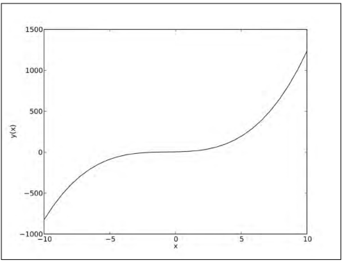

- subplot函数；绘图时可能会遇到图中有太多曲线的情况,而你希望分组绘制它们

- Matplotlib中有便捷的hist函数可以绘制直方图

- Matplotlib中有semilogx函数（对x轴取对数）、semilogy函数（对y轴取对数）	和loglog函数（同时对x轴和y轴取对数）

- Matplotlib的scatter函数可以创建散点图

- fill_between函数使用指定的颜色填充图像中的区域

- legend函数创建透明的图例，并由Matplotlib自动确定其摆放位置

- annotate函数在图像上精确地添加注释，并有很多可选的注释和箭头风格

- 3d关键字来指定图像的三维投影：fig.add_subplot(111, projection='3d') 

- meshgrid函数创建一个二维的坐标网格

- ax.plot_surface(x, y, z, rstride=4, cstride=4, cmap=cm.YlGnBu_r)

- contour函数创建一般的等高线图

- 对于色彩填充的等高线图，可以使用contourf绘制


