# Tensorflow

### [【4小时快速入门】Tensorflow2.1](https://www.bilibili.com/video/BV1j741127Zi?p=5)

[源码下载](http://pan.baidu.com/s/19XC28Hz_TwnSQeuVifg1UQ  )，提取码：mocm


### 3张量生成

- 张量（Tensor）：多维数组（列表）

  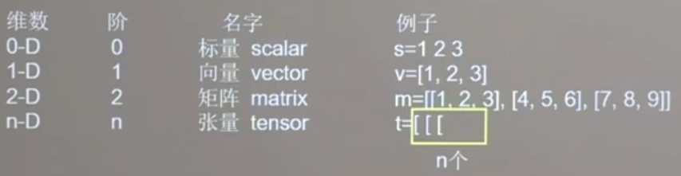

- 数据类型

  - tf.int 	tf.float
  - tf.boll
  - tf.string

- 创建一个张量：==tf.constant(张量内容，dtype=数据类型(可选))==

  - ==tf.zeros(维度)==：创建全0张量
  - ==tf.ones(维度)==：创建全1张量
  - ==tf.fill(维度，指定值)==：创建全指定值的张量
  - ==tf.random.normal(维度， mean=均值，stddev=标准差)==：生成正态分布的随机数
  - ==tf.random.truncated_normal(维度，mean=均值，stddev=标准差)==：生成截断式正态分布的随机数
  - ==tf.random.uniform(维度，minval=最小值，maxval=最大值)==：生成均匀分布随机数

  

### 4-5常用函数

- ==tf.cast(张量名，dtype=数据类型)==：强制tensor转换为该数据类型

- ==tf.reduce_min(张量名)==：计算张量维度上元素的最小值

- ==tf.reduce_max(张量名)==：计算张量维度上元素的最大值

- ==tf.reduce_mean(张量名，axis=操作轴)==：计算张量指定维度的平均值

- ==tf.reduce_sum(张量名，axis=操作轴)==：计算张量指定维度的和

- ==tf.Variable(初始值)==：将变量标记为可训练，被标记的变量会在反向传播中记录梯度信息（常用该函数标记待训练参数）

  - ```python
    w=tf.Variable(tf.random.normal([2,2],mean=0,stddev=1))
    ```

- 四则运算：维度相同

  - ==tf.add(张量1，张量2)==：加
  - ==tf.subtract(张量1，张量2)==：减
  - ==tf.multiply(张量1，张量2)==：乘
  - ==tf.divide(张量1，张量2)==：除
  - ==tf.square(张量名)==：平方
  - ==tf.pow(张量名，n次方数)==：n次方
  - ==tf.sqrt(张量名)==：开方

- ==tf.matmul(矩阵1，矩阵2)==：矩阵乘

- ==tf.data.Dataset.from_tensor_slices==：切分传入张量的第一维度，生成输入特征/标签对，构建数据集

  - ```
    data=tf.data.Dataset.from_tensor_slices((输入特征,标签)
    ```


- ==tf.GradientTape==：实现某个函数对指定参数的求导运算。

  - ```
    with tf.GradientTape() as tape:		#with结构记录计算过程
    	若干计算过程
    grad=tape.gradient(函数，对谁求导)		#gradient求出张量的梯度
    
        with tf.GradientTape() as tape:  # with结构到grads框起了梯度的计算过程。
            w = tf.Variable(tf.constant(5))
            loss = tf.pow(w + 1)
        grads = tape.gradient(loss, w) 
        print(grad)
    out:	tf.Tensor(6.0,shape=(),dtype=float32)
    ```

- ==enumerate==：可遍历每个元素（列表，元组，字符串），==组合为：索引 元素==，常在for循环使用

  - ```
    enumerate(列表名)
    
    seq = ['one', 'two', 'three']
    for i, element in enumerate(seq):
        print(i, element)
    out：	0 one
    		 1 two
    		 2 three
    ```

- ==tf.one_hot==：独热编码，在分类问题中，常用独热码做标签

  - ```
    tf.one_hot(待转换数据，depth=几分类)
    
    classes = 3
    labels = tf.constant([1, 0, 2])  # 输入的元素值最小为0，最大为2
    output = tf.one_hot(labels, depth=classes)
    print("result of labels1:", output)
    out：
    [[0. 1. 0.]
     [1. 0. 0.]
     [0. 0. 1.]]
    ```

- ==tf.nn.softmax==：当n分类的n个输出（y0,y1....yn）通过softmax函数便符合概率分布了。

  - ```
    y = tf.constant([1.01, 2.01, -0.66])
    y_pro = tf.nn.softmax(y)
    print("After softmax, y_pro is:", y_pro)  # y_pro 符合概率分布
    out：
    After softmax, y_pro is: tf.Tensor([0.25598174 0.69583046 0.04818781], shape=(3,), dtype=float32)
    ```

- ==assign_sub==：自更新函数

  - 赋值操作，更新参数的值并返回

  - 调用该函数前，先用tf.Variable定义变量w为可训练

  - ```
    w.assign_sub(w要自减的内容)
    
    x = tf.Variable(4)
    x.assign_sub(1)
    print("x:", x)  # 4-1=3
    ```

- ==tf.argmax==：返回张量沿指定维度最大值的索引

  - ```
    tf.argmax(张量名，axis=操作轴)
    
    test = np.array([[1, 2, 3], [2, 3, 4], [5, 4, 3], [8, 7, 2]])
    print("test:\n", test)
    print("每一列的最大值的索引：", tf.argmax(test, axis=0))  # 返回每一列最大值的索引
    print("每一行的最大值的索引", tf.argmax(test, axis=1))  # 返回每一行最大值的索引
    out：
    每一列的最大值的索引： tf.Tensor([3 3 1], shape=(3,), dtype=int64)
    每一行的最大值的索引 tf.Tensor([2 2 0 0], shape=(4,), dtype=int64)
    ```


### 9.神经网络优化_预备知识

- ==tf.where(条件语句，真返回A，假返回B)==：

  - ```
    a = tf.constant([1, 2, 3, 1, 1])
    b = tf.constant([0, 1, 3, 4, 5])
    c = tf.where(tf.greater(a, b), a, b)  # 若a>b，返回a对应位置的元素，否则返回b对应位置的元素
    print("c：", c)
    out：
    c： tf.Tensor([1 2 3 4 5], shape=(5,), dtype=int32)
    ```

- ==np.random.RandomState.rand(维度)==：返回[0,1)之间的随机数

  - ```
    rdm = np.random.RandomState(seed=1)		#常数每次生成随机数相同
    a = rdm.rand()			#返回一个随机标量
    b = rdm.rand(2, 3)		#返回维度为2行3列随机数矩阵
    print("a:", a)
    print("b:", b)
    out：
    a: 0.417022004702574
    b: [[7.20324493e-01 1.14374817e-04 3.02332573e-01]
     [1.46755891e-01 9.23385948e-02 1.86260211e-01]]
    ```

- ==np.vstack(数组1，数组2)==：将两个数组按垂直方向叠加

  - ```
    a = np.array([1, 2, 3])
    b = np.array([4, 5, 6])
    c = np.vstack((a, b))
    print("c:\n", c)
    out：
    c:
    [[1 2 3]
     [4 5 6]]
    ```

- ==np.mgrid[起始值：结束值：步长，起始值：结束值：步长，...]==：返回若干组维度相同的等差数组

- ==x.ravel()===：将x变为以为数组，变量拉直

- ==np.c_[数组1，数组2，...]==：使返回的间隔数值点配对

  - ```
    x, y = np.mgrid[1:3:1, 2:4:0.5]
    grid = np.c_[x.ravel(), y.ravel()]
    print("x:\n", x)
    print("y:\n", y)
    print("x.ravel():\n", x.ravel())
    print("y.ravel():\n", y.ravel())
    print('grid:\n', grid)
    out：
    x:
     [[1. 1. 1. 1.]
     [2. 2. 2. 2.]]
    y:
     [[2.  2.5 3.  3.5]
     [2.  2.5 3.  3.5]]
    x.ravel():
     [1. 1. 1. 1. 2. 2. 2. 2.]
    y.ravel():
     [2.  2.5 3.  3.5 2.  2.5 3.  3.5]
    grid:
     [[1.  2. ]
     [1.  2.5]
     [1.  3. ]
     [1.  3.5]
     [2.  2. ]
     [2.  2.5]
     [2.  3. ]
     [2.  3.5]]
    ```


### 12损失函数

- ==loss_mse = tf.reduce_mean(tf.square(y_ - y))==：均方误差
- ==tf.losses.categorical_crossentropy(y_,y)==：交叉熵损失函数

- ==tf.nn.softmax_cross_entropy_with_logits(y_, y)==：输出先过softmax函数，在计算交叉熵随时函数

  - ```
    y_pro = tf.nn.softmax(y)
    
    loss_ce1 = tf.losses.categorical_crossentropy(y_,y_pro)
    loss_ce2 = tf.nn.softmax_cross_entropy_with_logits(y_, y)
    ```


### 13缓解过拟合

正则化在损失函数中引入模型复杂度指标，利用给w加权值，弱化了训练数据的噪声（一般不正则化b）

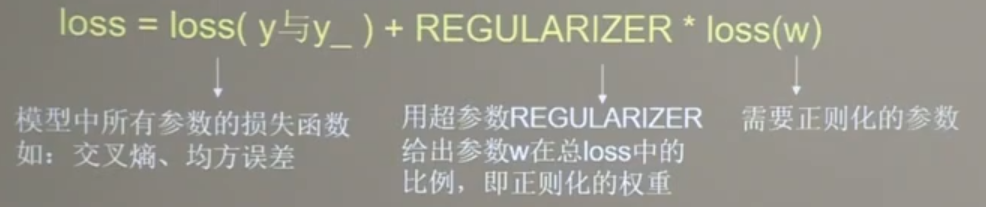

- L1正则化：大概率回事很多参数变为0，因此该方法可通过稀疏参数，即减少参数的数量，降低复杂度

  - 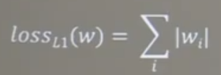

- L2正则化：回事参数很接近0但不为0，因此该方法可通过减小参数值的大小减低复杂度

  - 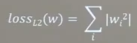

  - ```
    loss_mse = tf.reduce_mean(tf.square(y_train - y))
    
    loss_regularization = []
    loss_regularization.append(tf.nn.l2_loss(w1))
    loss_regularization.append(tf.nn.l2_loss(w2))
    loss_regularization = tf.reduce_sum(loss_regularization)
    loss = loss_mse + 0.03 * loss_regularization 
    ```


### 14.优化器

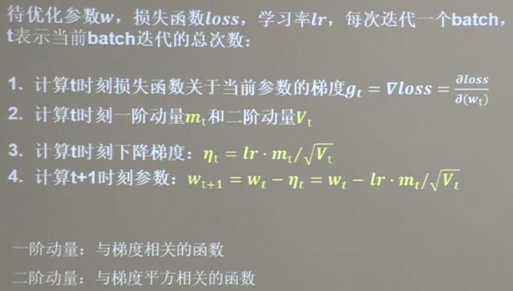

1. SGD，常用的梯度下降法

   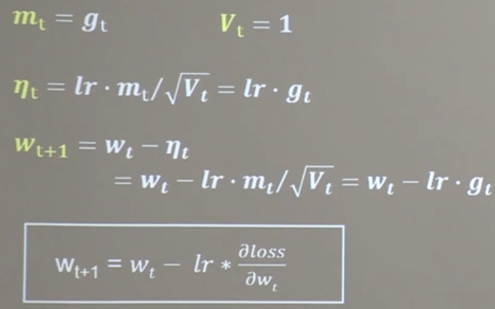

   ```
   grads = tape.gradient(loss, [w1, b1])
   w1.assign_sub(lr * grads[0])  # 参数w1自更新
   b1.assign_sub(lr * grads[1])  # 参数b自更新
   ```

2. SGDM，在SGD基础上增加一阶动量

   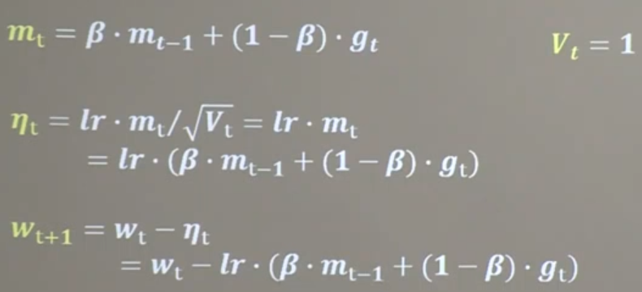

   ```
   m_w, m_b = 0, 0
   beta = 0.9
   grads = tape.gradient(loss, [w1, b1])
   m_w = beta * m_w + (1 - beta) * grads[0]
   m_b = beta * m_b + (1 - beta) * grads[1]
   w1.assign_sub(lr * m_w)
   b1.assign_sub(lr * m_b)
   ```

3. Adagrad，在SGD基础上增加二阶动量

   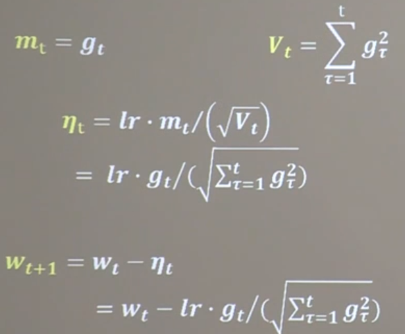

   ```
   v_w, v_b = 0, 0
   grads = tape.gradient(loss, [w1, b1])
   v_w += tf.square(grads[0])
   v_b += tf.square(grads[1])
   w1.assign_sub(lr * grads[0] / tf.sqrt(v_w))
   b1.assign_sub(lr * grads[1] / tf.sqrt(v_b))
   ```

4. RMSProp，SGD基础上增加二阶动量

   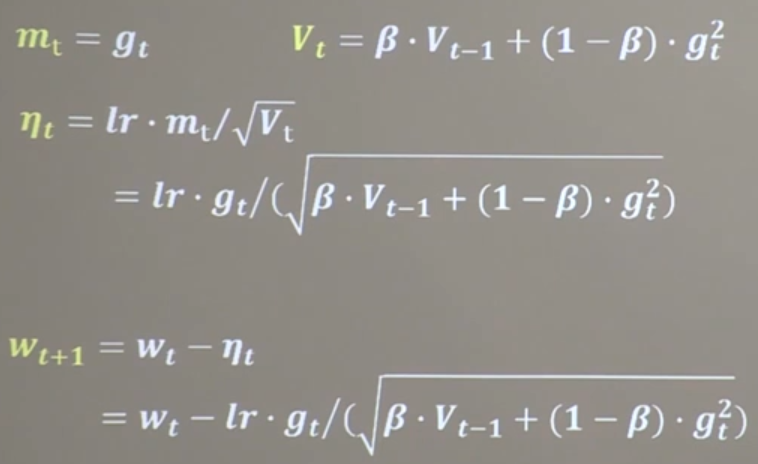

   ```
   v_w, v_b = 0, 0
   beta = 0.9
   grads = tape.gradient(loss, [w1, b1])
   v_w = beta * v_w + (1 - beta) * tf.square(grads[0])
   v_b = beta * v_b + (1 - beta) * tf.square(grads[1])
   w1.assign_sub(lr * grads[0] / tf.sqrt(v_w))
   b1.assign_sub(lr * grads[1] / tf.sqrt(v_b))
   ```

5. Adam，同时结合SGDM一阶动量和RMSProp二阶动量

   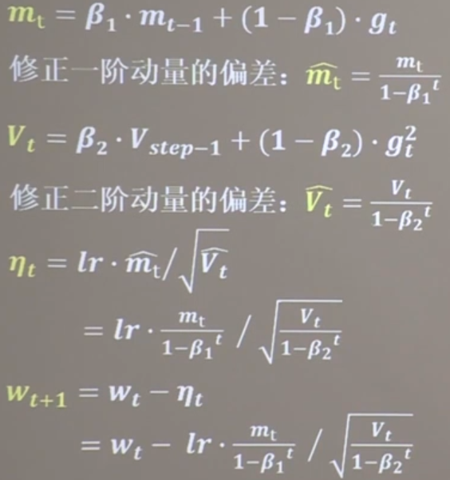

   ```
   m_w, m_b = 0, 0
   v_w, v_b = 0, 0
   beta1, beta2 = 0.9, 0.999
   delta_w, delta_b = 0, 0
   global_step = 0
   
   m_w = beta1 * m_w + (1 - beta1) * grads[0]
   m_b = beta1 * m_b + (1 - beta1) * grads[1]
   v_w = beta2 * v_w + (1 - beta2) * tf.square(grads[0])
   v_b = beta2 * v_b + (1 - beta2) * tf.square(grads[1])
   
   m_w_correction = m_w / (1 - tf.pow(beta1, int(global_step)))
   m_b_correction = m_b / (1 - tf.pow(beta1, int(global_step)))
   v_w_correction = v_w / (1 - tf.pow(beta2, int(global_step)))
   v_b_correction = v_b / (1 - tf.pow(beta2, int(global_step)))
   
   w1.assign_sub(lr * m_w_correction / tf.sqrt(v_w_correction))
   b1.assign_sub(lr * m_b_correction / tf.sqrt(v_b_correction))
   ```

   

### 15.使用八股搭建神经网络

六步法：

1. ==import==

2. ==train，test==

3. ==model=tf.keras.models.Sequential([网络结构])==          #搭建神经网络，逐层描述网络结构

   - 拉直层：tf.keras.layers.Flatten()
   - 全连接层：tf.keras.layers.Dense(神经元个数、activation='激活函数'，kernel_regularize=那种正则化)
   - 卷积层：tf.keras.layers.Conv2D(filters=卷积核个数，kernel_size=卷积核尺寸，strides=卷积步长，padding=“vaild” or “same”)
   - LSTM层：tf.keras.layers.LSTM()

4. ==model.compile(optimizer=优化器，loss=损失函数，metrics=["准确率"])==             #配置训练方法，优化器、损失函数等

   - 优化器可选：

     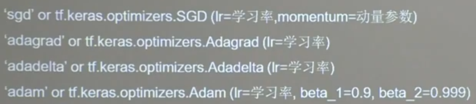

   - loss可选：

     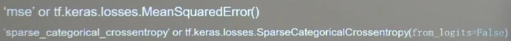

   - metrics可选：

     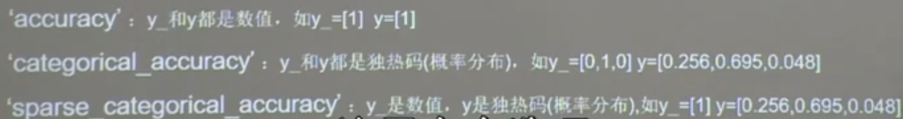

5. ==model.fit(训练集输入特征，训练集的标签，==

   ​						==batch_size=   ，epochs=   ，==

   ​						==validation_data=(测试集的输入特征，测试机的标签)，==

   ​						==validation_split=从训练集划分多少比例给测试集，==

   ​						==validation_fred=多少次epoch测试一次)==                         

6. ==model.summary()==           #打印出网络结构和参数统计


### 16.class搭建神经网络结构

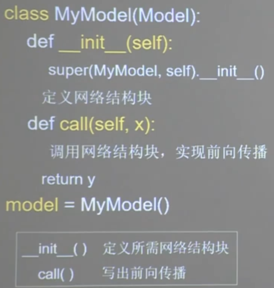

```
from tensorflow.keras import Model
class IrisModel(Model):
    def __init__(self):
        super(IrisModel, self).__init__()
        self.d1 = Dense(3, activation='softmax', kernel_regularizer=tf.keras.regularizers.l2())

    def call(self, x):
        y = self.d1(x)
        return y

model = IrisModel()
```


### 19-25.神经网络八股功能扩展

1. **自制数据集，解决本领域应用**

   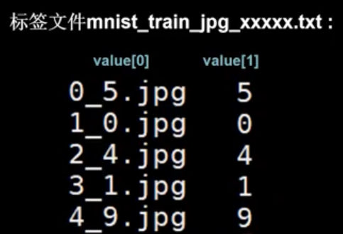

   def generateds(图片路径，标签文件)

   ```python
   def generateds(path, txt):
       f = open(txt, 'r')  # 以只读形式打开txt文件
       contents = f.readlines()  # 读取文件中所有行
       f.close()  # 关闭txt文件
       x, y_ = [], []  # 建立空列表
       for content in contents:  # 逐行取出
           value = content.split()  # 以空格分开，图片路径为value[0] , 标签为value[1] , 存入列表
           img_path = path + value[0]  # 拼出图片路径和文件名
           img = Image.open(img_path)  # 读入图片
           img = np.array(img.convert('L'))  # 图片变为8位宽灰度值的np.array格式
           img = img / 255.  # 数据归一化 （实现预处理）
           x.append(img)  # 归一化后的数据，贴到列表x
           y_.append(value[1])  # 标签贴到列表y_
           print('loading : ' + content)  # 打印状态提示
   
       x = np.array(x)  # 变为np.array格式
       y_ = np.array(y_)  # 变为np.array格式
       y_ = y_.astype(np.int64)  # 变为64位整型
       return x, y_  # 返回输入特征x，返回标签y_
   ```

   

2. **数据增强，扩充数据集**

   ==image_gen_train=tf.keras.preprocessing.image.ImageDataGenerator()==

   - rescale=所有数据将乘以该数值
   - rotation_range=随机旋转角度数范围
   - width_shift_range=随机宽度偏移量
   - height_shift_rang=随机高度偏移量
   - 水平翻转：horizontal_flip=是否随机水平翻转
   - 随机缩放：zoom_range=随机缩放的范围[1-n, 1+n]

   ==image_gen_train.fit(x_train)==

   ```python
   image_gen_train = ImageDataGenerator(
       rescale=1. / 255,		#图像归一化0-1
       rotation_range=45,		#随机45度旋转
       width_shift_range=.15,	#宽度偏移
       height_shift_range=.15,	#高度偏移
       horizontal_flip=False,	#水平翻转
       zoom_range=0.5)			#将图像随机缩放阈值50%
   image_gen_train.fit(x_train)
   ```

   

3. **断点续训，存取模型**

   ==读取模型：load_weights(路径文件名)==

   ```
   checkpoint_save_path = "./checkpoint/mnist.ckpt"
   if os.path.exists(checkpoint_save_path + '.index'):
       print('-------------load the model-----------------')
       model.load_weights(checkpoint_save_path)
   ```

   ==保存模型：tf.keras.callbacks.ModelCheckpoint(==

   ​								==filepath=路径文件名,==

   ​								==save_weights_only=True/False,		#是否只保留模型参数==

   ​								==save_best_only=True/False		#是否只保留最优结果)==

   ​	==history=model.fit(callbacks=[cp_callback])		#加入callback选项，记录在history中==

   ```
   cp_callback = tf.keras.callbacks.ModelCheckpoint(filepath=checkpoint_save_path,
                                                    save_weights_only=True,
                                                    save_best_only=True)
   history = model.fit(x_train, y_train, batch_size=32, epochs=5, validation_data=(x_test, y_test), validation_freq=1,callbacks=[cp_callback])
   ```

   

4. **参数提取，把参数存入文本**

   ==model.trainable_variables==：返回模型中可训练的参数

   ==np.set_printoptions(threshold=超过多少省略显示	#np.inf表示无限大)==  

   ```
   np.set_printoptions(threshold=np.inf)
   print(model.trainable_variables)
   file = open('./weights.txt', 'w')
   for v in model.trainable_variables:
       file.write(str(v.name) + '\n')
       file.write(str(v.shape) + '\n')
       file.write(str(v.numpy()) + '\n')
   file.close()
   ```

   

5. **acc/loss可视化，查看训练效果**

   history=model.fit(训练集数据，训练集标签，batch_size=，epochs=，validation_split=用作测试数据的比例，validation_data=测试集，validation_freq=测试频率)

   history：

   - 训练集loss：loss

   - 测试集loss：val_loss

   - 训练集准确率：sparse_categorical_accuracy

   - 测试集准确率：val_sparse_categorical_accuracy

     ```
     acc = history.history['sparse_categorical_accuracy']
     val_acc = history.history['val_sparse_categorical_accuracy']
     loss = history.history['loss']
     val_loss = history.history['val_loss']
     ```

     

6. **应用程序，绘图识物**

   ==predict(输入特征，batch_size=整数)：返回前向传播计算结果==             

   ```
   model = tf.keras.models.Sequential([
       tf.keras.layers.Flatten(),
       tf.keras.layers.Dense(128, activation='relu'),
       tf.keras.layers.Dense(10, activation='softmax')])		#复现模型（前向传播）
       
   model.load_weights(model_save_path)			#加载参数
   
   result = model.predict(x_predict)			#预测结果
   ```

   ​                                                                                                           

### 26-35卷积计算过程

1. **感受野：**卷积神经网络各输出特征图中的每个像素点，在原始输入图片上映射区域的大小

   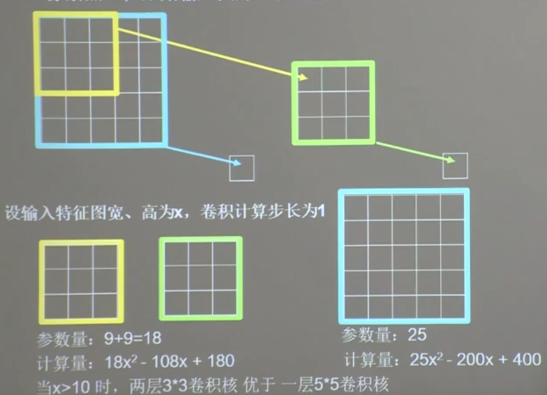

   

2. **全零填充**：参数padding=‘SAME’ 或 padding=‘VALID’

   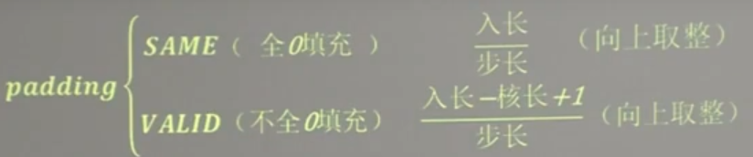

   

3. **TF描述卷积计算层**

   ==tf.keras.layers.Conv2D(==

   ​				==filters=卷积核个数，==

   ​				==kernel_size=卷积核尺寸，	#正方形写核长整数，或（核高h，核宽w）==

   ​				==strides=滑动步长，	#横纵向相同写步长整数，或（纵向步长h，横向步长w），默认1==

   ​				==padding=“same” or “valid”	#使用全零填充是same，不使用默认为valid==

   ​				==activation=“relu” or “sigmoid” or “tanh” or “softmax” 等==

   ​				==input_shape=(高，宽，通道数)	#输入特征图维度，可省略)==

   ```python
   model=tf.keras.models.Sequential([
   	Conv2D(6,5,padding='valid',activation='sigmoid'),
   	MaxPool2D(2,2),
   	Conv2D(6,(5,5),padding='valid',activation='sigmoid'),
   	MaxPool2D(2,(2,2)),
   	Conv2D(filters=6,kernel_size=(5,5),padding='valid',activation='sigmoid'),
   	MaxPool2D(pool_size=(2,2),strides=2),
   	Flatten(),
   	Dense(10,activation='softmax')
   ])
   ```

   

4. **批标准化（Batch Bormalization，BN）**

   - 标准化：使数据符合0均值，1为标准差的分布

   - 批标准化：对一小批数据（batch），做标准化处理

     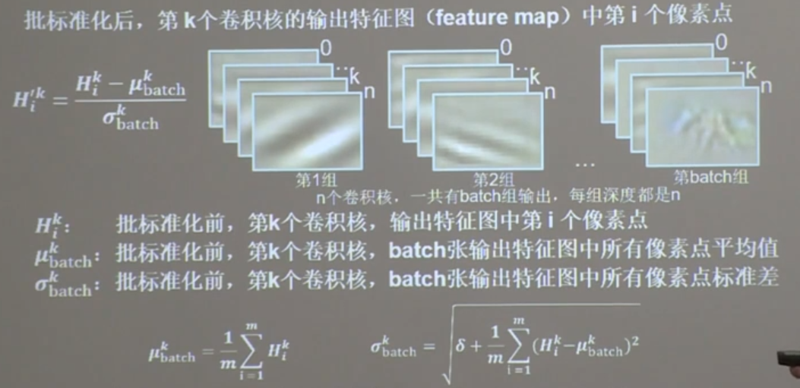

     ==tf.keras.layers.BatchNormalization()==

     ```
     model=tf.keras.models.Sequential([
     	Conv2D(filters=6,kernel_size=(5,5),padding='same'),		#卷积层
     	BatchNormalization(),		#BN层
     	Activation=('relu'),		#激活层
     	MaxPool2D(pool_size=(2,2),strides=2,padding='same'),
     	Dropout(0,2),
     	])
     ```

     

5. **池化（Pooling）**

   - ==tf.keras.layers.MaxPool2D(==

     ​		==pool_size=池化核尺寸，		#正方形写核长整数，或（核高h，核宽w）==

     ​		==strides=池化步长，		#步长整数，或（纵向步长h，横向步长w），默认pool_size==

     ​		==padding='valid' or 'same' 		#使用全零填充是same。默认不使用valid==

     ​	==)==

   - ==tf.keras.layers.AveragePooling2D(==

     ​		==pool_size=池化核尺寸，		#正方形写核长整数，或（核高h，核宽w）==

     ​		==strides=池化步长，		#步长整数，或（纵向步长h，横向步长w），默认pool_size==

     ​		==padding='valid' or 'same' 		#使用全零填充是same。默认不使用valid==

     ​	==)==

     ```
     MaxPool2D(pool_size=(2,2),strides=2,padding='same')
     ```

     

6. **舍弃（Dropout）**

   ==tf.keras.layers.Dropout(舍弃的概率)==

   ```
   Dropout(0,2)
   ```

   

7. **卷积神经网络**（特征提取器，CBAPD）

   

   

8. **cifar10数据集**

9. **卷积神经网络搭建示例**

10. **实现经典卷积神经网络（LeNet、AlexNet、VGGNet、InceptionNet、ResNet）**


### 36.LeNet卷积神经网络

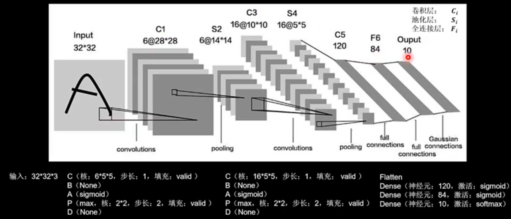


```python
class LeNet5(Model):
    def __init__(self):
        super(LeNet5, self).__init__()
        self.c1 = Conv2D(filters=6, kernel_size=(5, 5),
                         activation='sigmoid')
        self.p1 = MaxPool2D(pool_size=(2, 2), strides=2)

        self.c2 = Conv2D(filters=16, kernel_size=(5, 5),
                         activation='sigmoid')
        self.p2 = MaxPool2D(pool_size=(2, 2), strides=2)

        self.flatten = Flatten()
        self.f1 = Dense(120, activation='sigmoid')
        self.f2 = Dense(84, activation='sigmoid')
        self.f3 = Dense(10, activation='softmax')
```


### 37.AlexNet

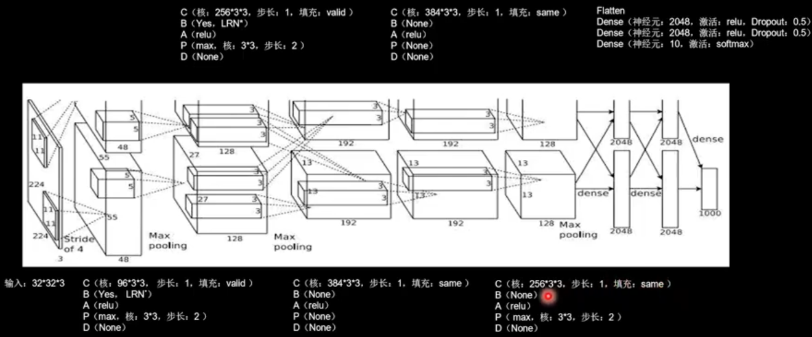


```python
class AlexNet8(Model):
    def __init__(self):
        super(AlexNet8, self).__init__()
        self.c1 = Conv2D(filters=96, kernel_size=(3, 3))
        self.b1 = BatchNormalization()
        self.a1 = Activation('relu')
        self.p1 = MaxPool2D(pool_size=(3, 3), strides=2)

        self.c2 = Conv2D(filters=256, kernel_size=(3, 3))
        self.b2 = BatchNormalization()
        self.a2 = Activation('relu')
        self.p2 = MaxPool2D(pool_size=(3, 3), strides=2)

        self.c3 = Conv2D(filters=384, kernel_size=(3, 3), padding='same',
                         activation='relu')
                         
        self.c4 = Conv2D(filters=384, kernel_size=(3, 3), padding='same',
                         activation='relu')
                         
        self.c5 = Conv2D(filters=256, kernel_size=(3, 3), padding='same',
                         activation='relu')
        self.p3 = MaxPool2D(pool_size=(3, 3), strides=2)

        self.flatten = Flatten()
        self.f1 = Dense(2048, activation='relu')
        self.d1 = Dropout(0.5)
        self.f2 = Dense(2048, activation='relu')
        self.d2 = Dropout(0.5)
        self.f3 = Dense(10, activation='softmax')
```


### 38.VGGNet

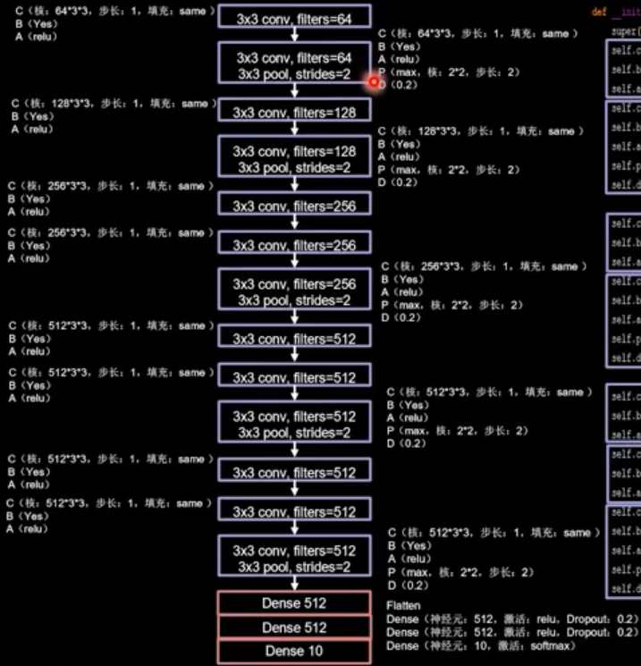


```python
class VGG16(Model):
    def __init__(self):
        super(VGG16, self).__init__()
        self.c1 = Conv2D(filters=64, kernel_size=(3, 3), padding='same')  # 卷积层1
        self.b1 = BatchNormalization()  # BN层1
        self.a1 = Activation('relu')  # 激活层1
        self.c2 = Conv2D(filters=64, kernel_size=(3, 3), padding='same', )
        self.b2 = BatchNormalization()  # BN层1
        self.a2 = Activation('relu')  # 激活层1
        self.p1 = MaxPool2D(pool_size=(2, 2), strides=2, padding='same')
        self.d1 = Dropout(0.2)  # dropout层

        self.c3 = Conv2D(filters=128, kernel_size=(3, 3), padding='same')
        self.b3 = BatchNormalization()  # BN层1
        self.a3 = Activation('relu')  # 激活层1
        self.c4 = Conv2D(filters=128, kernel_size=(3, 3), padding='same')
        self.b4 = BatchNormalization()  # BN层1
        self.a4 = Activation('relu')  # 激活层1
        self.p2 = MaxPool2D(pool_size=(2, 2), strides=2, padding='same')
        self.d2 = Dropout(0.2)  # dropout层

        self.c5 = Conv2D(filters=256, kernel_size=(3, 3), padding='same')
        self.b5 = BatchNormalization()  # BN层1
        self.a5 = Activation('relu')  # 激活层1
        self.c6 = Conv2D(filters=256, kernel_size=(3, 3), padding='same')
        self.b6 = BatchNormalization()  # BN层1
        self.a6 = Activation('relu')  # 激活层1
        self.c7 = Conv2D(filters=256, kernel_size=(3, 3), padding='same')
        self.b7 = BatchNormalization()
        self.a7 = Activation('relu')
        self.p3 = MaxPool2D(pool_size=(2, 2), strides=2, padding='same')
        self.d3 = Dropout(0.2)

        self.c8 = Conv2D(filters=512, kernel_size=(3, 3), padding='same')
        self.b8 = BatchNormalization()  # BN层1
        self.a8 = Activation('relu')  # 激活层1
        self.c9 = Conv2D(filters=512, kernel_size=(3, 3), padding='same')
        self.b9 = BatchNormalization()  # BN层1
        self.a9 = Activation('relu')  # 激活层1
        self.c10 = Conv2D(filters=512, kernel_size=(3, 3), padding='same')
        self.b10 = BatchNormalization()
        self.a10 = Activation('relu')
        self.p4 = MaxPool2D(pool_size=(2, 2), strides=2, padding='same')
        self.d4 = Dropout(0.2)

        self.c11 = Conv2D(filters=512, kernel_size=(3, 3), padding='same')
        self.b11 = BatchNormalization()  # BN层1
        self.a11 = Activation('relu')  # 激活层1
        self.c12 = Conv2D(filters=512, kernel_size=(3, 3), padding='same')
        self.b12 = BatchNormalization()  # BN层1
        self.a12 = Activation('relu')  # 激活层1
        self.c13 = Conv2D(filters=512, kernel_size=(3, 3), padding='same')
        self.b13 = BatchNormalization()
        self.a13 = Activation('relu')
        self.p5 = MaxPool2D(pool_size=(2, 2), strides=2, padding='same')
        self.d5 = Dropout(0.2)

        self.flatten = Flatten()
        self.f1 = Dense(512, activation='relu')
        self.d6 = Dropout(0.2)
        self.f2 = Dense(512, activation='relu')
        self.d7 = Dropout(0.2)
        self.f3 = Dense(10, activation='softmax')

    def call(self, x):
        x = self.c1(x)
        x = self.b1(x)
        x = self.a1(x)
        x = self.c2(x)
        x = self.b2(x)
        x = self.a2(x)
        x = self.p1(x)
        x = self.d1(x)

        x = self.c3(x)
        x = self.b3(x)
        x = self.a3(x)
        x = self.c4(x)
        x = self.b4(x)
        x = self.a4(x)
        x = self.p2(x)
        x = self.d2(x)

        x = self.c5(x)
        x = self.b5(x)
        x = self.a5(x)
        x = self.c6(x)
        x = self.b6(x)
        x = self.a6(x)
        x = self.c7(x)
        x = self.b7(x)
        x = self.a7(x)
        x = self.p3(x)
        x = self.d3(x)

        x = self.c8(x)
        x = self.b8(x)
        x = self.a8(x)
        x = self.c9(x)
        x = self.b9(x)
        x = self.a9(x)
        x = self.c10(x)
        x = self.b10(x)
        x = self.a10(x)
        x = self.p4(x)
        x = self.d4(x)

        x = self.c11(x)
        x = self.b11(x)
        x = self.a11(x)
        x = self.c12(x)
        x = self.b12(x)
        x = self.a12(x)
        x = self.c13(x)
        x = self.b13(x)
        x = self.a13(x)
        x = self.p5(x)
        x = self.d5(x)

        x = self.flatten(x)
        x = self.f1(x)
        x = self.d6(x)
        x = self.f2(x)
        x = self.d7(x)
        y = self.f3(x)
        return y
```


### 39.InceptionNet

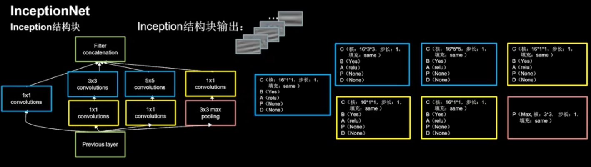

```python
class ConvBNRelu(Model):
    def __init__(self, ch, kernelsz=3, strides=1, padding='same'):
        super(ConvBNRelu, self).__init__()
        self.model = tf.keras.models.Sequential([
            Conv2D(ch, kernelsz, strides=strides, padding=padding),
            BatchNormalization(),
            Activation('relu')
        ])

    def call(self, x):
        x = self.model(x, training=False) #在training=False时，BN通过整个训练集计算均值、方差去做批归一化，training=True时，通过当前batch的均值、方差去做批归一化。推理时 training=False效果好
        return x
       
class InceptionBlk(Model):
    def __init__(self, ch, strides=1):
        super(InceptionBlk, self).__init__()
        self.ch = ch
        self.strides = strides
        self.c1 = ConvBNRelu(ch, kernelsz=1, strides=strides)
        self.c2_1 = ConvBNRelu(ch, kernelsz=1, strides=strides)
        self.c2_2 = ConvBNRelu(ch, kernelsz=3, strides=1)
        self.c3_1 = ConvBNRelu(ch, kernelsz=1, strides=strides)
        self.c3_2 = ConvBNRelu(ch, kernelsz=5, strides=1)
        self.p4_1 = MaxPool2D(3, strides=1, padding='same')
        self.c4_2 = ConvBNRelu(ch, kernelsz=1, strides=strides)

    def call(self, x):
        x1 = self.c1(x)
        x2_1 = self.c2_1(x)
        x2_2 = self.c2_2(x2_1)
        x3_1 = self.c3_1(x)
        x3_2 = self.c3_2(x3_1)
        x4_1 = self.p4_1(x)
        x4_2 = self.c4_2(x4_1)
        # concat along axis=channel
        x = tf.concat([x1, x2_2, x3_2, x4_2], axis=3)
        return x
```


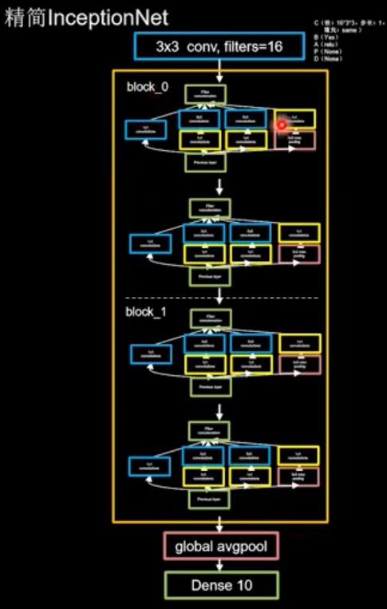

```python
class Inception10(Model):
    def __init__(self, num_blocks, num_classes, init_ch=16, **kwargs):
        super(Inception10, self).__init__(**kwargs)
        self.in_channels = init_ch
        self.out_channels = init_ch
        self.num_blocks = num_blocks
        self.init_ch = init_ch
        self.c1 = ConvBNRelu(init_ch)
        self.blocks = tf.keras.models.Sequential()
        for block_id in range(num_blocks):
            for layer_id in range(2):
                if layer_id == 0:
                    block = InceptionBlk(self.out_channels, strides=2)
                else:
                    block = InceptionBlk(self.out_channels, strides=1)
                self.blocks.add(block)
            # enlarger out_channels per block
            self.out_channels *= 2
        self.p1 = GlobalAveragePooling2D()
        self.f1 = Dense(num_classes, activation='softmax')

    def call(self, x):
        x = self.c1(x)
        x = self.blocks(x)
        x = self.p1(x)
        y = self.f1(x)
        return y
```


### 40.ResNet

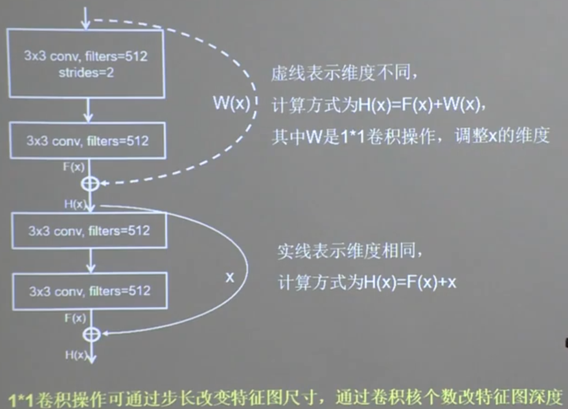

```python
class ResnetBlock(Model):
    def __init__(self, filters, strides=1, residual_path=False):
        super(ResnetBlock, self).__init__()
        self.filters = filters
        self.strides = strides
        self.residual_path = residual_path

        self.c1 = Conv2D(filters, (3, 3), strides=strides, padding='same', use_bias=False)
        self.b1 = BatchNormalization()
        self.a1 = Activation('relu')

        self.c2 = Conv2D(filters, (3, 3), strides=1, padding='same', use_bias=False)
        self.b2 = BatchNormalization()

        # residual_path为True时，对输入进行下采样，即用1x1的卷积核做卷积操作，保证x能和F(x)维度相同，顺利相加
        if residual_path:
            self.down_c1 = Conv2D(filters, (1, 1), strides=strides, padding='same', use_bias=False)
            self.down_b1 = BatchNormalization()
        
        self.a2 = Activation('relu')

    def call(self, inputs):
        residual = inputs  # residual等于输入值本身，即residual=x
        # 将输入通过卷积、BN层、激活层，计算F(x)
        x = self.c1(inputs)
        x = self.b1(x)
        x = self.a1(x)

        x = self.c2(x)
        y = self.b2(x)

        if self.residual_path:
            residual = self.down_c1(inputs)
            residual = self.down_b1(residual)

        out = self.a2(y + residual)  # 最后输出的是两部分的和，即F(x)+x或F(x)+Wx,再过激活函数
        return out
```


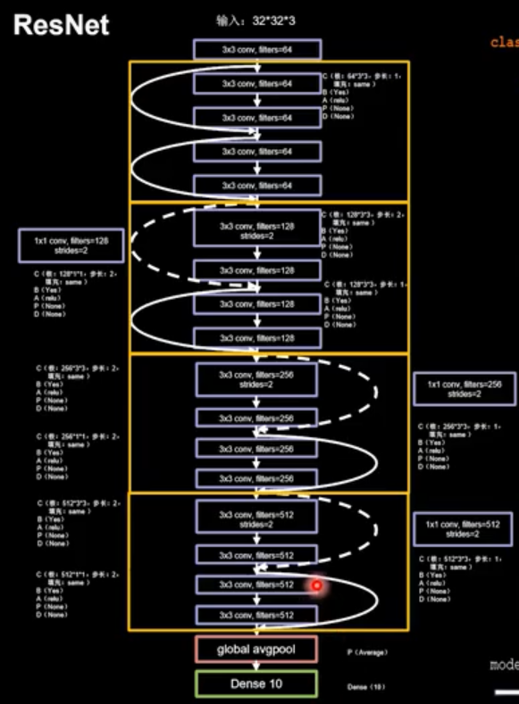


```python
class ResNet18(Model):

    def __init__(self, block_list, initial_filters=64):  # block_list表示每个block有几个卷积层
        super(ResNet18, self).__init__()
        self.num_blocks = len(block_list)  # 共有几个block
        self.block_list = block_list
        self.out_filters = initial_filters
        self.c1 = Conv2D(self.out_filters, (3, 3), strides=1, padding='same', use_bias=False)
        self.b1 = BatchNormalization()
        self.a1 = Activation('relu')
        self.blocks = tf.keras.models.Sequential()
        # 构建ResNet网络结构
        for block_id in range(len(block_list)):  # 第几个resnet block
            for layer_id in range(block_list[block_id]):  # 第几个卷积层

                if block_id != 0 and layer_id == 0:  # 对除第一个block以外的每个block的输入进行下采样
                    block = ResnetBlock(self.out_filters, strides=2, residual_path=True)
                else:
                    block = ResnetBlock(self.out_filters, residual_path=False)
                self.blocks.add(block)  # 将构建好的block加入resnet
            self.out_filters *= 2  # 下一个block的卷积核数是上一个block的2倍
        self.p1 = tf.keras.layers.GlobalAveragePooling2D()
        self.f1 = tf.keras.layers.Dense(10, activation='softmax', kernel_regularizer=tf.keras.regularizers.l2())

    def call(self, inputs):
        x = self.c1(inputs)
        x = self.b1(x)
        x = self.a1(x)
        x = self.blocks(x)
        x = self.p1(x)
        y = self.f1(x)
        return y
```


### 41.总结卷积网络

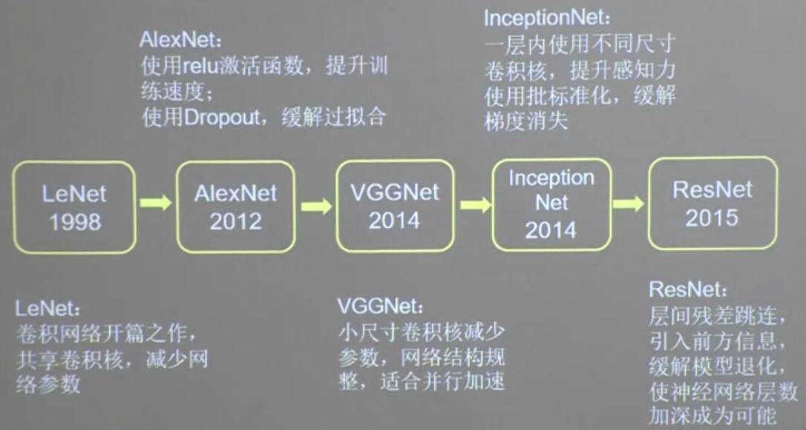


