# pandas与excel办公自动化

[B站链接](https://www.bilibili.com/video/BV1Ni4y1t7tf)

# 1、简单介绍

### p1 课程简介

- pandas.append()

  


- pandas.join()

  

  

- pandas.concat()

  

  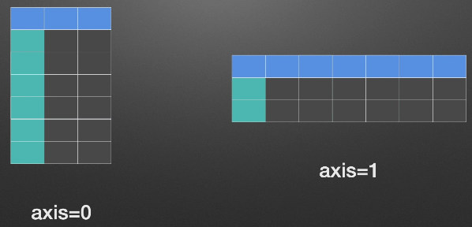

- pandas.merge()

  依照某些列相同的元素，把两个表格连接在一起

  

  

  

- 两种窗口操作

  - rolling()	: 	固定窗口的滚动求和操作

    

  - expanding()	:	扩展窗口的求和操作

    

### P2 pandas在工作中的示例

### P3 pandas简介

### P4 环境搭建

### P5 pandas中两个数据结构

- DataFrame：	2维数据
- Series：   1维数据
- pandas没有3维以上数据结构

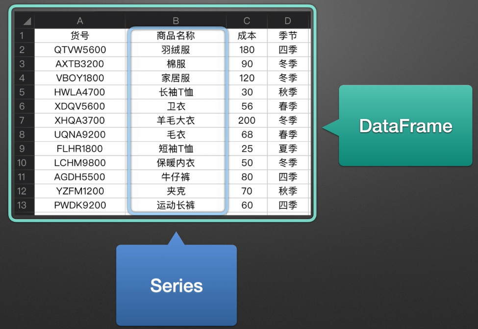

### P6 创建一个Series

- ```python
  s=pd.Series([1, 2, 3])
  ```

  ```
  0    1
  1    2
  2    3
  dtype: int64
  ```

- ```python
  s2=pd.Series([1,2,3],index=list('abc'),dtype='int64',name='num')
  ```

  ```
  a    1
  b    2
  c    3
  Name: num, dtype: int64
  ```

- ```python
  d={'a':1,'b':2,'c':3}
  s3=pd.Series(d)
  ```

  ```
  a    1
  b    2
  c    3
  dtype: int64
  ```

- ```python
  s4=pd.Series(3.0, index=['a','b','c'])
  ```

  ```
  a    3.0
  b    3.0
  c    3.0
  dtype: float64
  ```

### P7 创建一个DataFrame

1. 通过2维的list-like创建

   ```python
   list_2d = [[1,2],
              [3,4]]
   d1=pd.DataFrame(list_2d, columns=['A','B'], index=['x','y'])
   ```

   ```
      A  B
   x  1  2
   y  3  4
   ```

2. 通过字典创建

   ```python
   d={'A':[1,3],'B':[2,4]}
   d2=pd.DataFrame(d, index=['x','y'])
   ```

   ```
      A  B
   x  1  2
   y  3  4
   ```

3. 通过读取Excel表

   ```
   d3=pd.read_excel('xlsx练习.xlsx')
   ```


# 相关函数

### P8 read_excel() 函数

```python
pandas.read_excel(
	io,				#路径，StringIO，URL
	sheet_name=0,	#选择子表（sheet）
    header=0, 		#列索引（表头）
    index_col=None,	#行索引
    usecols=None,	#使用的列
    skiprows=None	#跳过行
)
```

- sheet_name
  - 默认：0，
  - int：选第几个sheet，从0开始
  - str：sheet的名字
  - list：[0,"str“]，返回字典
  - None：全部sheet，返回字典

- header：指定作为‘列索引’的行

- index_col：指定作为‘行索引’的列

- usecols：指定只使用那些列

  - None：全部（默认）
  - str：‘A，C’，‘A，C：E’
  - int-list：[0,2]
  - str-list:['AAA','CCC']
  - 函数：lambda x:x=='CCC'

- skiprows：跳过行

  - int-list：[0,2]
  - str：1，2，，，，

- names：要使用的列名列表，如果文件不包含标题行，则应显式传递header=None 

  - ```
    names=['str1', 'str2', 'str3']
    ```

- dtype：字典，{'列名'：‘类型’}，设置列的类型

  - ```
    dtype={'a':'float64, 'b':'int32' }
    ```

  - int8/int16/int32/int64（默认）：整型

  - float16/float32/float64（默认）：浮点型

  - str/string：字符串

  - bool：布尔

  - category：分类

  - datetime64[ns]：时间戳（纳秒）

  - period[Y/M/D]：时间周期（年/月/日）

  - objec：python对象混合类型

- parse_dates=False,     指定解析成日期格式的列

  - True—>尝试解析index
  - [0,1] 或 ['a','b']—>尝试解析指定列作为一个单独的日期列
  - [[0, 1, 2]]—>结合多列解析为单个日期列
  - {‘日期’：[0, 1, 2]}—>同上，结果的列名改为日期  

- date_parser=None,     function，解析日期格式的函数

  ```
  df=pd.read_excel(
  	'文件名‘,
  	parse_dates=[0],
  	date_parser=lambda x : pd.to_datetime(
  		x,format='%Y年%m月%d日'
  	)
  )
  ```

- na_values：scalar,str,list-like,or dict,default None.

  - 识别为NaN（缺失值）的其他字符串

  - dict：解析指定列

  - scalar，str，list-like：解析全局

  - ```
    na_values=['a',0, ' ']
    na_values={'列1'：['a',0, ' ']}
    ```

- converters：dict，默认 None，值转换函数

  ```
  df=pd.read_excel(
  	'文件名'，
  	converters={
  		'货号'：lambda x:x.strip()
  	}
  )
  ```

  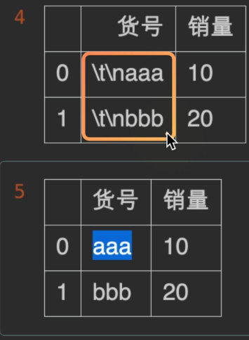

- true_values：list，默认None；视为True的值

- false_values：list，默认None；视为false的值

  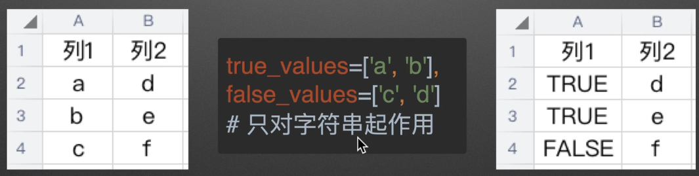

  一列必须全部可以转换才会转换，第二列e，f存在，所以转换失败。

- squeeze：bool，默认False；如果数据只有一列，是否返回一个Series

  

- mangle_dupe_cols：bool，默认False；是否重命名重复列名

  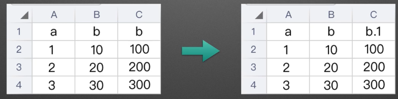

- nrows：int，默认None；要解析的行数

  

- thousands：str，默认None；千位分隔符，用于将字符串列解析为数字

  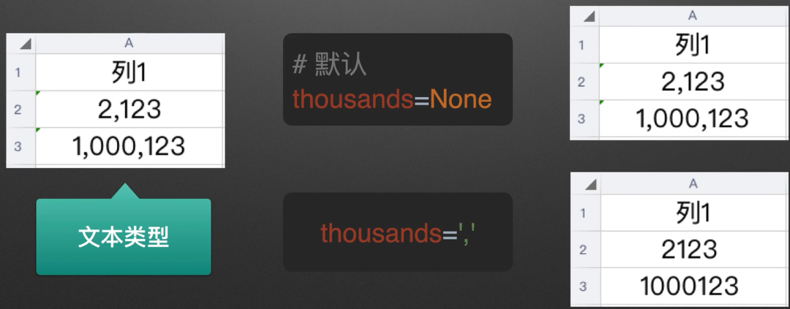

- convert_float：bool，默认True；在可能的情况下，是否将float转换为int（即1.0—>1）

  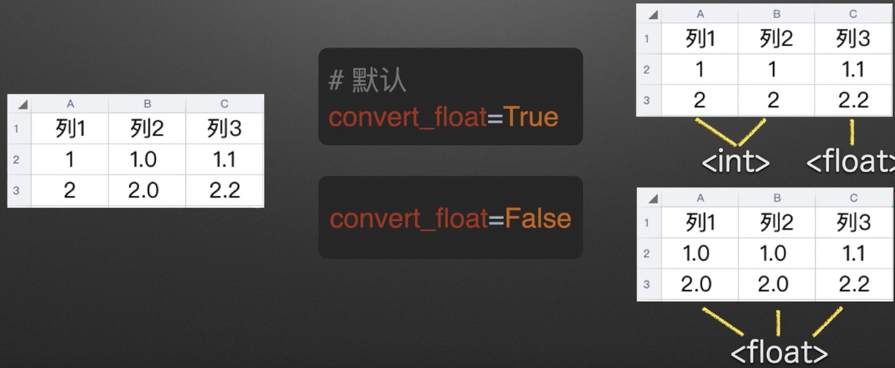

  

### P20 to_excel

```python
pd.DataFrame.to_excel(
    self,
    excel_writer,           #文件路径/ExcelWriter
    sheet_name='Sheet1',    #sheet名字
    index=True,             #是否输出index
    float_format=None,      #浮点数输出格式，如：“%.2f”    #保留两位小数点
    na_rep=' ',             #缺失值输出的表示形式
)
```

- index：bool，default，True；是否输出index（行索引）

  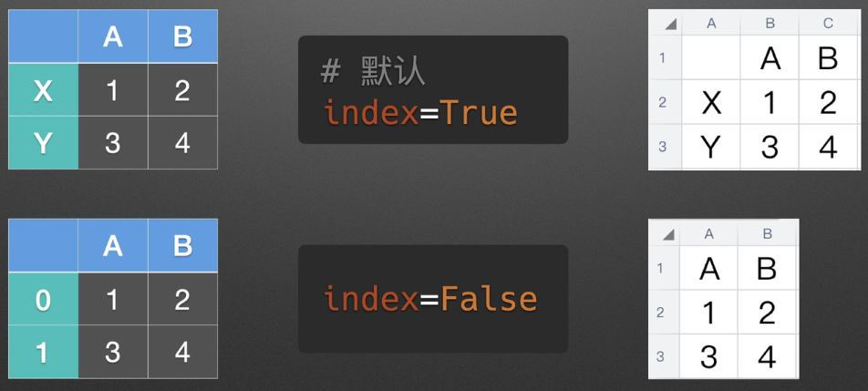

- ```
  class pandas.ExcelWriter(
  	path					#xls/xlsx文件路径
  	datetime_format=None	#datatime输出格式
  								默认：'YYYY-MM-DD HH:MM:SS'
  )
  ```

  - 设置datatime输出格式

  - 输出多个sheet

  - ```
    with pd.ExcelWriter('tb.xlsx'
    	datetime_format='YYYY-MM-DD') as writer：
    	df1.to_excel(writer,sheet_name='AAA')
    	df2.to_excel(writer,sheet_name='BBB')
    ```


### P22 读写csv

```
df.to_csv(
	path_or_buf,		#路径
	sep=',',			#分隔符
	encoding='utf8'		#gbk,gb2321,gb18030
)
```

```
Pd.read_csv(
	filepath,			#路径
	sep=',',			#分隔符
	encoding='utf8'		#gbk，gb2321,gb18030
)
```


# pandas选择数据

### P23 index索引

- 识别

  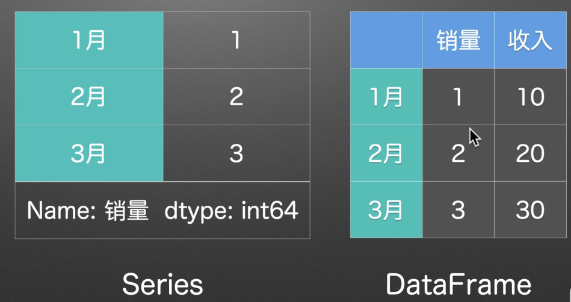

- 对齐

  ​	

  

- 获取和设置

  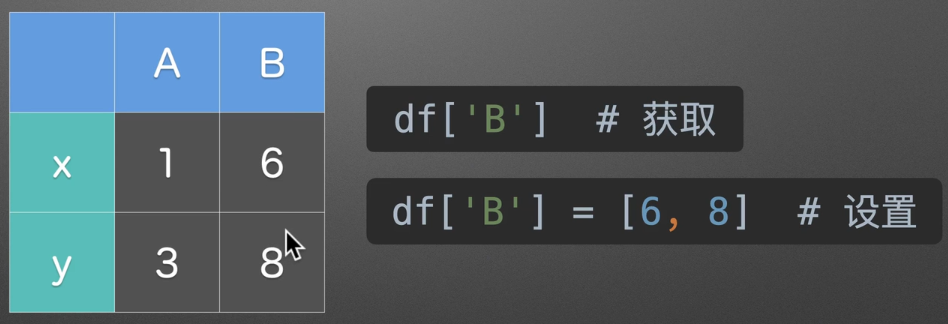


**位置索引和标签索引**


注意：

1. 索引有重复
2. 用非默认整数


### P24 dict-like  字典

​	通过字典选取数据。选取的是一列的数据。

```
s=pd.Series(
    {'A':1,'B':2, 'C':3}
)
df=pd.DataFrame(
    {
        'A':[1, 4, 7],
        'B':[2, 5, 8],
        'C':[3, 6, 9],
    }
)
```

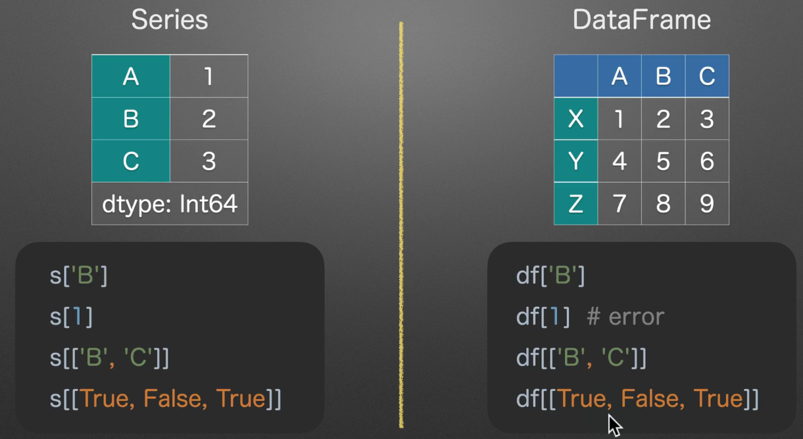

s[1]取到第二行的数据，df[1]错误，因为没有找到1对应的数据，

### P25 list-like 切片

通过切片选取数据，选取的是一行的数据。

```
s=pd.Series(
    {'A':1,'B':2, 'C':3}
)
df=pd.DataFrame(
    {
        'A':[1, 4, 7],
        'B':[2, 5, 8],
        'C':[3, 6, 9],
    }, index=list('xyz')
)
```

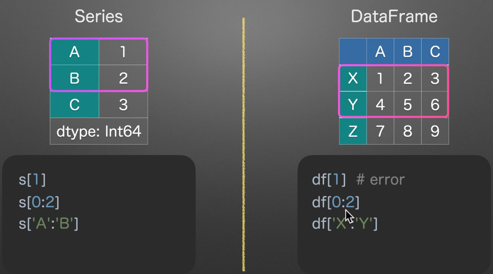


### P26 .点选

通过点选选择数据

- Series.index_name

  ```
  s=pd.Series(
      [1, 2, 3, 4],
      index=['total', '列', 'sum', 'dtype']
  )
  print(s.total)
  ```

  ```
  total    1
  列        2
  sum      3
  dtype    4
  dtype: int64
  ```

  Series是一列，index定义每一行的名称

- DataFrame.columns_name

  ```
  df = pd.DataFrame(
      [[1, 2, 3, 4],
       [5, 6, 7, 8]],
      columns=['total', '列', 'sum', 'dtype']
  )
  print(df.total)
  ```

  ```
     total  列  sum  dtype
  0      1  2    3      4
  1      5  6    7      8
  ```

  DataFrame是二维数组，columns定义每一列的名称

不推荐使用点选方式：

- 代码可读性不好
- 有可能与方法属性冲突


### P27 loc 位置

根据位置选择

`df.loc[row_indexer, column_indexer]`


### P28 iloc 

使用整数索引选择

`df.iloc[row_indexer, column_indexer]`

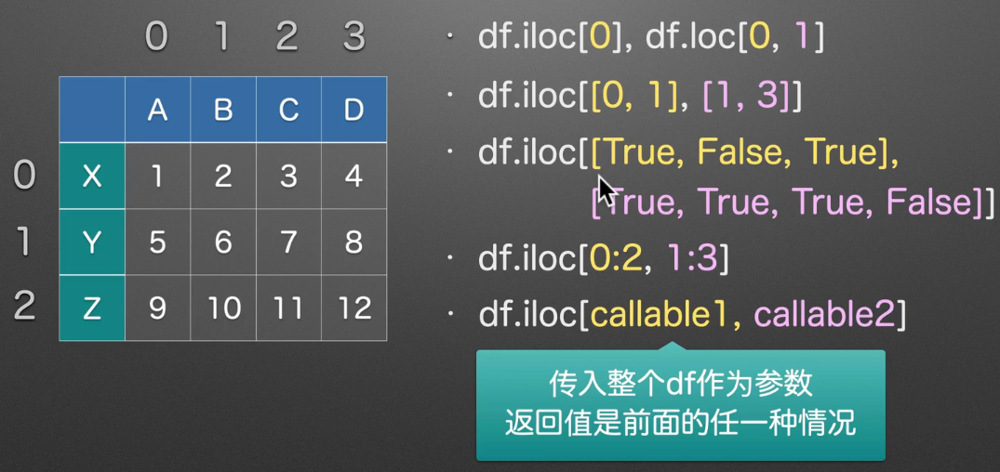

选择单个值时

- `.loc==.at`
- `.iloc==.iat`


## 数据赋值

### P29赋值

Series


- 直接选择：s[0]=10
- iloc选择：s.iloc[1]=11
- loc选择：s.loc['C']=12
- 创建新一列：s.loc['D']=13
- 切片查找：s.iloc[1:3]=20
- 切片索引：s.loc['C':'D']=30
- 使用条件：s[s>25]=100

DataFrame


- df['A']=100
- df['B']=df['B']*10
- df['E']=df['C']+df['D']
- df.loc[df['E']>10,'E']=200
- df.loc['Y':'Z','C':'D']=666


### P30加减乘除

注意：

- 对空值的处理

  

  - 

    一种是将空值替换为0，另一种是使用对应函数。

- 对除数为0的处理

  

  

  ​	将无穷大的值解释为空值！


### P31、32扩展：Series的index不对齐情况

```
s1=pd.Series([1,2],index=['a','b'])
s2=pd.Series([10,20],index=['c','b'])

s1.add(s2,fill_value=0)Out[19]: 
a     1.0
b    22.0
c    10.0
```


### P33 计算操作 MultiIndex多层索引

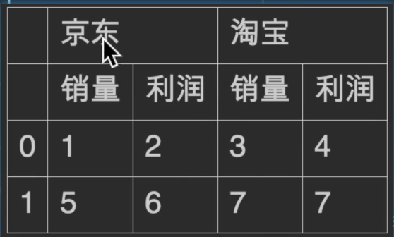

```python
df[('京东','销量')]+df[('淘宝'，'销量')]
out： 4
	  12
    
df_total=df['京东']+df['淘宝']
out：
	销量	利润
0	4	  6
1	12	  13

df_total.columns=pd.MultiIndex.form_product(
	[
		['总']
		df_total.columns
	])
out:
		总
	销量	利润
0	4	  6
1	12	  13
df.join(df_total)
```


### P34


